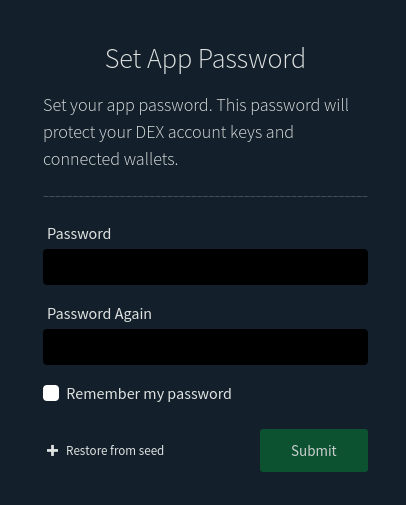
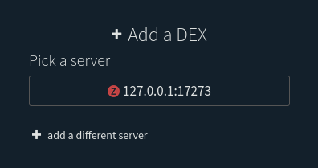

# 

[](https://github.com/decred/dcrdex/actions)
[](http://copyfree.org)
[](https://pkg.go.dev/decred.org/dcrdex)

## What is DEX?

The Decred Decentralized Exchange (DEX) is a system that enables trustless
exchange of different types of blockchain assets via a familiar market-based
API. DEX is a non-custodial solution for cross-chain exchange based on
atomic swap technology. DEX matches trading parties and facilitates price
discovery and the communication of swap details.

Matching is performed through a familiar exchange interface, with market and
limit orders and an order book. Settlement occurs on-chain. DEX's epoch-based
matching algorithm and rules of community conduct ensure that the order book
action you see is real and not an army of bots.

Trades are performed directly between users through on-chain contracts with no
actual reliance on DEX, though swap details must be reported both as a
courtesy and to prove compliance with trading rules. Trades are settled with
pure 4-transaction atomic swaps and nothing else. Because DEX collects no
trading fees, there's no intermediary token and no fee transactions.

Although trading fees are not collected, DEX does require a one-time
registration fee to be paid on-chain. Atomic swap technology secures all trades,
but client software must still adhere to a set of policies to ensure orderly
settlement of matches. The maximum penalty imposable by DEX is loss of trading
privileges and forfeiture of registration fee.

## Contents

- [Client Quick Start Installation](#client-quick-start-installation)
- [Client Configuration](#client-configuration)
- [Important Stuff to Know](#important-stuff-to-know)
- [Advanced Client Installation](#advanced-client-installation)
- [DEX Specification](#dex-specification)
- [Client Applications and the Core Package](#client-applications-and-the-core-package)
- [Server Installation](#server-installation)
- [Contribute](#contribute)

## Client Quick Start Installation

- It is recommended to have at least 2 GB of available system memory and 25 GB of free disk space to run the DEX client. For the most secure setup, you can also install in a fresh virtual machine.

You can use the 
[**dcrinstall**](https://github.com/decred/decred-release/releases) tool to
install everything you need. **dcrinstall** will guide you through installation
of all needed software and help set up your Decred wallet.

`./dcrinstall --dcrdex`

**dcrinstall** will create a directory for your decred binaries.
For Linux and Mac, the directory is at *~/decred*. For Windows, it's 
*%HOMEPATH%\decred*. Any commands listed below are assumed be run from this
directory. Instructions are for Linux. For Windows, you will drop the
`./` prefix for commands.

**WARNING**: If instead of using **dcrinstall* you decide to build from source and
you plan to trade on mainnet, use the `release-0.1` branch instead of `master`.
Furthermore, if you build dcrd and dcrwallet from source, you must use their
`release-v1.6` branches, not `master`.

### Sync Blockchains

Once installed, begin syncing your blockchains. In a new console, run 

`cd ~/decred`

`./dcrd`

Decred should sync within a couple of hours.

In a different console, start syncing Bitcoin.

`./bitcoind`

The initial Bitcoin sync duration will vary, but more than a day is not
atypical. By default, Bitcoin will run with **pruning** enabled. This will keep
your blockchain storage down to a few GB, rather than the 400+ GB required to
store the full blockchain. Note that you will download and validate the entire
400+ GB blockchain, but pruning will discard all but the critical parts.

You can modify **bitcoin.conf** to disable pruning. If this is all gibberish to
you, you probably don't need to worry about it.

### Important Notes on Wallets

- **If you already have Decrediton installed**, upgrade Decrediton before running **dcrinstall**.

- The DEX client is not yet compatible with **dcrwallet**'s SPV-mode or CSPP mixed accounts.

- You must keep **dcrd**, **dcrwallet**, and **bitcoind** running while the client is running. Do not shut down, lock, unlock, or otherwise modify your wallet settings while the client is running.

- Because of the way fee estimation works, you should give **bitcoind** at least 6 blocks worth of run time before trading. Failing to allow **bitcoind** to "warm up" may result in higher transactions fees for your redemption transactions.

## Client Configuration

These instructions assume you've used the
[Client Quick Start Installation](#client-quick-start-installation). If you've
used a [custom installation](#advanced-client-installation) for the client
and/or blockchain software, adapt as necessary.

All commands listed below are of the Linux variety, and assume you already
`cd` into the `~/decred` directory created by **dcrinstall**.

### Prerequisites

1. dcrd, dcrwallet, and bitcoind should be running and synced.

2. It is highly recommended that you create separate accounts for trading. 

#### Creating a trading account for Decred

For Decred, start dcrwallet and create an account in your terminal or console
using the **dcrctl** utility.

`./dcrctl --wallet createnewaccount dex`

Your dex trading account uses the wallet password you've set up with
**dcrinstall** or `./dcrwallet --create`.

Get an address for the new account, and transfer some funds. You'll need to
deposit at least enough to cover the registration fee and on-chain fees for the
registration transaction. The registration process will inform you how much to
pay. At the time of writing, it was 1 DCR. Of course, if you plan to sell any
DCR, you should deposit that too.

`./dcrctl --wallet getnewaddress dex`

Alternatively, you can get a deposit address during registration right after
creating your wallet, from the wallets view link at the top right of the screen.

#### Creating a trading wallet for Bitcoin

For Bitcoin, you can create a trading wallet using the bitcoin-cli utility.
**bitcoin-cli** will be included in the quick-start installation as well. You
can replace `dex` with whatever name you want. The rest of the instructions
will assume you chose `dex`.

`./bitcoin-cli createwallet dex`

It is recommended that you password-protect your Bitcoin trading wallet.
We'll use `read` to prevent echoing the password.

`read -s BTCPASS`

Type your password and hit enter, then do

`./bitcoin-cli -rpcwallet=dex encryptwallet $BTCPASS`

You'll also want to instruct **bitcoind** to load the wallet at startup. Modify
your **bitcoin.conf** file, located in the **~/.bitcoin** directory on Linux,
**%APPDATA%\Bitcoin** on Windows, and **~/Library/Application Support/Bitcoin**
on Mac OS. Open the file in a text editor and add the following line at the end
of the file.

`wallet=dex`


### Connect Wallets and Register

1. Start the client. `./dexc`
2. In your browser, navigate to **localhost:5758**


3. Create your **client application password**. You will use this password to perform all future security-sensitive client operations, including registering, signing in, and trading.



4. Connect to your Decred wallet. The client will auto-fill most of your wallet settings, but you will need to specify the account name. If you haven't already, follow the instructions above to create a trading account. If you really, really want to trade on the default wallet account, the account name is `default`. Enter the wallet password, which is the password you set up with **dcrwallet**. Enter the app password you created in step 3.


5. Enter the dex address, probably **dex.decred.org**.



6. Check the registration fee, and enter your password one more time to authorize payment.


7. On the **markets view**, while you're waiting for confirmations on your registration fee, add a Bitcoin wallet. You'll need to specify the wallet name. If you haven't already, follow the instructions above to create a trading wallet. If you really, really want to trade on the default wallet, leave the wallet name blank. Enter the wallet password you set up with **bitcoin-cli**. If you really, really want to trade on an unencrypted wallet, you can leave the wallet password blank. Enter the app password you created in step 3.


8. And that's it! Once your registration fee has enough confirmations, you can begin trading.


## Important Stuff to Know

Trades settle on-chain and require block confirmations. Trades do not settle instantly.
In some cases, they may take hours to settle.
**The client software should not be shut down until you are absolutely certain that your trades have settled**.

**The client has to stay connected for the full duration of trade settlement**.
Losses of connectivity of a couple minutes are fine, but don't push it.
A loss of internet connectivity for more than 20 hours during trade settlement has the potential to result in lost funds.
Simply losing your connection to the DEX server does not put funds at risk.
You would have to lose connection to an entire blockchain network.

**There are initially limits on the amount of ordering you can do**.
We'll get these limits displayed somewhere soon, but in the meantime,
start with some smaller orders to build up your reputation. As you complete
orders, your limit will go up.

**If your account is suspended**, you can appeal the suspension.
You may be asked to provide client log files to the operator for review.
For dex.decred.org, reach out 
[on Element](https://matrix.to/#/!mlRZqBtfWHrcmgdTWB:decred.org?via=decred.org&via=matrix.org&via=planetdecred.org)
to appeal.


## Advanced Client Installation

### Dependencies

1. [Go >= 1.15](https://golang.org/doc/install)
2. [Node 14+](https://docs.npmjs.com/downloading-and-installing-node-js-and-npm) is used to bundle resources for the browser interface. It's important to note that the DEX client has no external javascript dependencies. The client doesn't import any Node packages. We only use Node to lint and compile our own javascript and css resources.
3. [dcrd](https://github.com/decred/dcrd/tree/master) and [dcrwallet](https://github.com/decred/dcrwallet/tree/master) (non-SPV), installed from the [v1.6.x release binaries](https://github.com/decred/decred-release/releases/tag/v1.6.1), or built from the `release-v1.6` branch.
4. [Bitcoin Core v0.20.x](https://bitcoincore.org/en/download/) (bitcoind or bitcoin-qt) wallet, **encrypted**.
5. At least 2 GB of available system memory.

See the [wiki](../../wiki/Testnet-Testing) for details on preparing the wallets.

**Build the web assets** from *client/webserver/site/*.

```
npm clean-install
npm run build
```

**Build and run the client** from *client/cmd/dexc*.

```
go build
./dexc --testnet
```

Connect to the client from your browser at `localhost:5758`.

While `dexc` may be run from within the git workspace as described above, the
`dexc` binary executable generated with `go build` and the entire `site` folder
may be copied into a different folder as long as `site` is in the same directory
as `dexc` (e.g. `/opt/dcrdex/dexc` and `/opt/dcrdex/site`).

### Docker

**Build the docker image**

```
docker build -t user/dcrdex -f client/Dockerfile .
```

**Create docker volume**

```
docker volume create --name=dcrdex_data
```

**Run image**

```
docker run -d --rm -p 127.0.0.1:5758:5758 -v dcrdex_data:/root/.dexc user/dcrdex
```


## DEX Specification

The [DEX specification](spec/README.mediawiki) details the messaging and trading
protocols required to use the Market API. Not only is the code in
in the **decred/dcrdex** repository open-source, but the entire protocol is
open-source. So anyone can, in principle, write their own client or server based
on the specification. Such an endeavor would be ill-advised in these early
stages, while the protocols are undergoing constant change.

## Client Applications and the Core Package

The initial DEX release also includes the client **Core** module, written in Go.
**Core** offers an intuitive programmer interface, with methods for creating
wallets, registering DEX accounts, viewing markets, and performing trades.

**dcrdex** has two applications built with **Core**.

The **browser-based GUI** (a.k.a. "the app") offers a familiar exchange
experience in your browser. The app is really just a one-client web server that
you run and connect to on the same machine. The market view allows you to see
the market's order book in sorted lists or as a depth chart. You can place your
order and monitor it's status in the same market view. The GUI application is
managed by the **dexc** utility in *client/cmd/dexc*.

The **dexcctl** utility enables trading via CLI. Commands are parsed and
issued to **Core** for execution. **dexcctl** also requires **dexc**.


## Server Installation

### Dependencies

1. Linux or MacOS
2. [Go >= 1.14](https://golang.org/doc/install)
3. [PostgreSQL 11+](https://www.postgresql.org/download/), [tuned](https://pgtune.leopard.in.ua/) and running.
4. Decred (dcrd) and Bitcoin (bitcoind) full nodes, both with `txindex` enabled.

### Set up the database

In a PostgreSQL `psql` terminal, run

```sql
CREATE USER dcrdex WITH PASSWORD 'dexpass';
CREATE DATABASE dcrdex_testnet OWNER dcrdex;
```

### Generate a dcrwallet account public key

The master public key is used for collecting registration fees.
Using [dcrctl](https://docs.decred.org/wallets/cli/dcrctl-basics/)
and [dcrwallet](https://github.com/decred/dcrwallet),
create a new account.

`dcrctl --wallet --testnet createnewaccount fees`

Get the master public key for the account.

`dcrctl --wallet --testnet getmasterpubkey fees`

Master public keys are network-specific, so make sure to specify the network
to both `dcrwallet` and `dcrctl`, if not using mainnet.

Place the pubkey string into a new DEX configuration file.

**~/.dcrdex/dcrdex.conf**

```ini
# Testnet extended pubkey
regfeexpub=tpubVWHTkHRefqHptAnBdNcDJ...

# PostgreSQL Credentials
pgpass=dexpass
```

*~/.dcrdex/* is the default **app data directory** location used by the
DEX server, but can be customized with the `--appdata` command-line argument.

### Run your asset daemons.

As of writing, only `dcrd`, `bitcoind`, and `litecoind` are supported. The
`txindex` configuration option must be set. Be sure to specify the correct
network if not using mainnet.

### Create the assets and market configuration file

A sample is given at
[*sample-markets.json*](server/cmd/dcrdex/sample-markets.json). See the
[**Per-asset Variables**](spec/admin.mediawiki) section of the specification for
more information on individual options.

### Build and run dcrdex

From a command prompt, navigate to **server/cmd/dcrdex**. Build the executable
by running `go build`. The generated executable will be named **dcrdex**. Run
`./dcrdex --help` to see configuration options that can be set either as a
command line argument or in the *dcrdex.conf* file. The
[**Exchange Variables**](spec/admin.mediawiki) section of the specification has
additional information on a few key options.

**Run the server.**

`./dcrdex --testnet`

from **server/cmd/dcrdex**.


## Contribute

**Looking to contribute? We need your help** to make DEX &#35;1.

Nearly all development is done in Go and JavaScript. Work is coordinated
through [the repo issues](https://github.com/decred/dcrdex/issues),
so that's the best place to start.
Before beginning work, chat with us in the
[DEX Development room](https://matrix.to/#/!EzTSRQITaqHuFBDFhM:decred.org?via=decred.org&via=matrix.org&via=zettaport.com).
The pace of development is pretty fast right now, so you'll be expected to keep
your pull requests moving through the review process.

Check out these wiki pages for more information.

- [Getting Started Contributing](../../wiki/Contribution-Guide)
- [Backend Development](../../wiki/Backend-Development)
- [Run **dcrdex** and **dexc** on simnet](../../wiki/Simnet-Testing). Recommended for development.
- [Run **dexc** on testnet](../../wiki/Testnet-Testing). Recommended for poking around.
- [Run the test app server](../../wiki/Test-App-Server). Useful for GUI development, or just to try everything out without needing to create wallets or connect to a **dcrdex** server.

## Source

The DEX [specification](spec/README.mediawiki) was drafted following stakeholder
approval of the
[specification proposal](https://proposals.decred.org/proposals/a4f2a91c8589b2e5a955798d6c0f4f77f2eec13b62063c5f4102c21913dcaf32).

The source code for the DEX server and client are being developed according to
the specification. This undertaking was approved via a second DEX
[development proposal](https://proposals.decred.org/proposals/417607aaedff2942ff3701cdb4eff76637eca4ed7f7ba816e5c0bd2e971602e1).
