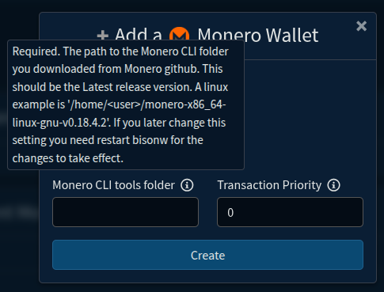
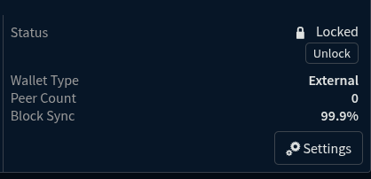

# Monero XMR Wallet for Dex

## About

This is information for running a Monero XMR exchange wallet on Dex.

## Requirements

Download the Monero CLI tools from <https://github.com/monero-project/monero/releases>.

The latest CLI tools release (August 2025) is <https://github.com/monero-project/monero/releases/tag/v0.18.4.2>

Download and verify the binary hashes and PGP signature then extract the `CLI tools` binaries to your home folder.

Click "Create Monero Wallet" then click "show additional settings".

Enter the full path to the folder where you put the CLI tools in the dialog shown on the "Create Monero Wallet" page when first creating a Dex Monero wallet.




## Remote Chain

A remote & restricted chain daemon will be used by default although this is considered less secure by the Monero community.

## Local Monero Chain

It is more secure to use a local daemon with a local copy of the blockchain. In this case it is also expected that the full chain has been downloaded to the local machine and fully synced to tip. It should also be running when you create or use the wallet.

See Also: Advanced configuration below.

## Advanced Configuration

### User Specified Daemon

Linux Example:

After  successfully creating the Dex wallet navigate to dex configuration folder at $HOME/.dexc/mainnet/assetdb/xmr/mainnet and create a file called `daemons.json`. Edit this file to identify your preferred daemon or daemons. 

Preferred Local Daemon

```json
[
    {
        "url": "http://127.0.0.1:18081",
        "net": "main",
        "tls": false
    }
]
```

Preferred Remote Daemon

```json
[
    {
        "url": "http://node.sethforprivacy.com:18089",
        "net": "main",
        "tls": false
    }
]
```

Restart BisonW app and your preferred daemon will be used.

## Wallet Sync

- When you first create a wallet it has to synchronize with a monero daemon.

- When you restart the wallet after BisonW has been off for a period of time the wallet has to synchronize with the monero daemon again.

This process can take some time.



While the wallet is syncing wallet functions are mostly not available.
