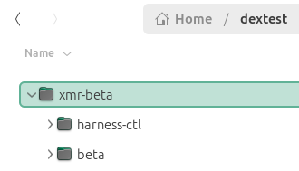

# Beta Development Harness

A Monero daemon harness for Dex application development.

- **beta** is a monero p2p daemon

## Prerequisites

- **monero-x86_64-linux-gnu-v0.18.4.2** or later <https://github.com/monero-project/monero/releases>
- **linux** (tested on Ubuntu 22.04, 24.04)
- **jq** (1.6)

## Setup

**monero-x86_64-linux-gnu-v0.18.4.2** folder should be in PATH

`export PATH=$PATH:[path-to]/monero-x86_64-linux-gnu-v0.18.4.2`

## Run

`./harness-beta.sh`

## Usage With simnet-walletpair

This harness is designed to be used with `simnet-walletpair` ensuring most development is directly in go.

Run `harness-beta` once for each time `simnet-walletpair` folder tree is deleted and recreated. **Each run creates a new chain**.

- start _this_ harness so that the daemon is running
- start all other needed harnesses: `dcr`, `btc`, ... `dcrdex`.
- start simnet-walletpair ...
- create new dex monero wallet(s) - the wallet password always will be 'sim'.
- get the wallet primary address from **monero-rpc-log** or **bisonw log** on wallet creation - this is the only wallet address that can be mined to.
- `start-mining <wallet-primary-address>` to the wallet primary address to fund the wallet.

When continuous mining into the wallet is not desired `stop-mining` to the wallet primary address. Continuous mining into a random but primary wallet address can be done. For example you could `start-mining` `4B2u3Ba6Fwu8mebFKELcDc1mjVUkDzMxdYwaAQUmi3G6fhcw9gU5NHp7WiYZ9hJmFvFogHYnEHu3ian8jJhukySDF4GnFcH` `30` to progress the chain every 30 seconds.

Alternatively the chain can be progressed 1 or several blocks using `mine-to-address address number` to the wallet primary address or a dummy primary address.

## Data Directory



## Background Mining Commands

Background mining is **Not** set up when the daemon starts as the mine-to address may not be known.

```text
start-mining

Start mining one block to the specified address every 'period' seconds.

inputs:

- mining address (must be valid primary address 4xx...)
- period in seconds (mine 1 block every n seconds)
  should be >= 15; real blocks are ~120 seconds

stop-mining

Stop the mining started with start-mining.
```

```text
mine-to-address

On demand generate 'number' blocks to the specified address.

inputs:

- mining address (must be valid primary address 4xx...)
- number of blocks to mine
```

## Other Commands

```text
beta_get_transactions

Get transaction(s) info for one or more txid.

- inputs:
  - tx_hashes - hash1,hash2,hash3,...

beta_get_transactions_details

Get parsed transaction(s) details from monerod including tx lock time.

- inputs:
  - tx_hashes - hash1,hash2,hash3,...

beta_info

Get running daemon details - height, etc.

- inputs: None

beta_sendrawtransaction

Broadcast a previously built signed tx.

- inputs:
  - tx_as_hex string

beta_transaction_pool

Get mempool details.

- inputs: None

quit

Shutdown the daemon and quit the harness.
```
