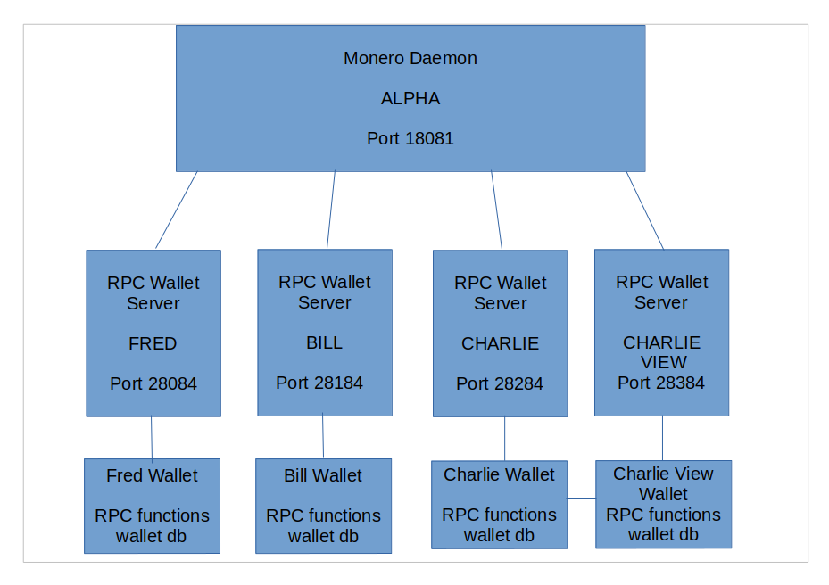
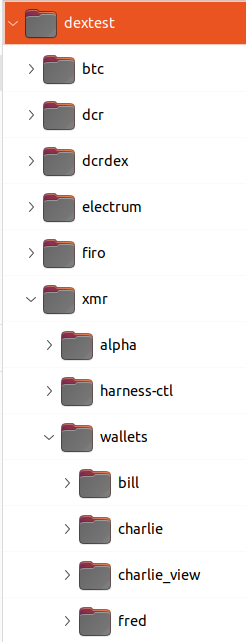

# Monero Development Harness

Monero development Harness - documentation and notes

## Useful Info

Monero is very different than btc in that it does not provide a single rpc
tool like `bitcoin-cli` but rather a set of json 2.0 & other older json apis
which can be accessed by sending curl requests for each one.

Monero wallets are accounts based

<https://web.getmonero.org/resources/moneropedia/account.html>

## Architecture



Embedded in Tmux

- **alpha** is a monero p2p daemon

- **bill** is a miner wallet .. you can top up more funds from bill if you run out

- **fred** is a normal wallet user

- **charlie** is a normal wallet user

- **charlie_view** is a view-only wallet sibling of charlie full wallet - no spend key

## Using

### Prerequisites

- **monero-x86_64-linux-gnu-v0.18.3.3** or later <https://downloads.getmonero.org/cli/linux64>
- **linux** (tested on Ubuntu 22.04)
- **jq** (1.6)

### Setup

**monero-x86_64-linux-gnu-v0.18.3.3** should be in PATH

`export PATH=$PATH:[path-to]/monero-x86_64-linux-gnu-v0.18.3.3`

### Background Mining

By default background mining is set up and mines to bill wallet every 15s

To disable:

`export NOMINER="1" to your shell`

 or else invoke the harness with:

`NOMINER="1" ./harness.sh`

You should disable if attempting the manual offline cold signing using `monero-wallet-cli`

You should also ctl-C charlie & charlie_view wallets for this

### Run

`./harness.sh`

### Data Directory



### Known Issues

The transaction spend locking needs more investigation

### Commands Help

run `./help` from the tmux harness window 0

```text

Commands Help:
--------------
alpha_get_transactions

- get transaction details for one or more txid
- inputs:
  - tx_hashes - hash1,hash2,hash3,...
  - decode_as_json - Optional - returns more detail but in a escaped raw json format

alpha_info

- get running daemon details - height, etc.
- inputs: None

alpha_sendrawtransaction

- broadcast a previously built signed tx
- inputs:
  - tx_as_hex string - can be generated with charlie_build_tx or fred_build_tx

alpha_transaction_pool

- get mempool details
- inputs: None

mine-to-bill

- generate 1 or more blocks to bill wallet
- inputs:
  - num_blocks - defaults to 1

bill_balance

- get bill wallet balance details
- inputs: None

bill_refresh_wallet

- update bill's wallet from the daemon latest info
- inputs: None

bill_transfer_to

- build, sign and broadcast a transaction from bill wallet to another address
- inputs:
  - amount in in atomic units 1e12 - e.g. 1230000000000 echo = 1.23 XMR
  - address - recipient primary address - account index 0, subaddr_indeces [0]
  - unlock_time - unlock after n blocks and make spendable - defaults to 0 (no lock)

charlie_balance

- get charlie wallet balance details
- inputs: None

charlie_refresh_wallet

- update charlie's wallet from the daemon latest info
- inputs: None

charlie_build_tx

- build a signed tx for later broadcasting using alpha_send
- inputs:
  - amount in in atomic units 1e12 - e.g. 1230000000000 = 1.23 XMR
  - address - recipient primary address - account index 0, subaddr_indeces [0]
  - unlock_time - unlock after n blocks and make spendable - defaults to 0 (no lock)
-outputs:
  - signed tx_blob
  - tx_hash

charlie_incoming_transfers

- get a list of incoming mined transfers to charlie wallet
- inputs: None

charlie_transfer_to

- build, sign and broadcast a transaction from charlie wallet to another address
- inputs
  - amount in in atomic units 1e12 - e.g. 1230000000000 echo = 1.23 XMR
  - address - recipient primary address - account index 0, subaddr_indeces [0]
  - unlock_time - unlock after n blocks and make spendable - defaults to 0 (no lock)

fred_export_outputs

- export fred outputs hex
- input:
  - all - defaults to true - otherwise only new outputs since the last call

charlie_export_outputs

- export charlie outputs hex
- input:
  - all - defaults to true - otherwise only new outputs since the last call

charlie_view_export_outputs

- export charlie_view outputs hex - charlie_view knows the outputs but has no spend key
- inputs: None
- only useful in offline, cold signing process using monero-wallet-cli interactive tool
  must be hex decoded into a file to use in monero-wallet-cli

fred_export_key_images

- export signed key images from fred wallet - an array of key images and ephemeral signatures
- input:
  - all - defaults to true - otherwise only new key images since the last call

charlie_export_key_images

- export signed key images from charlie wallet - an array of key images and ephemeral signatures
- input:
  - all - defaults to true - otherwise only new key images since the last call

fred_balance

- get fred wallet balance details
- inputs: None

fred_refresh_wallet

- update fred's wallet from the daemon latest info
- inputs: None

fred_build_tx

- build a signed tx for later broadcasting using alpha_send
- inputs:
  - amount in in atomic units 1e12 - e.g. 1230000000000 = 1.23 XMR
  - address - recipient primary address - account index 0, subaddr_indeces [0]
  - unlock_time - unlock after n blocks and make spendable - defaults to 0 (no lock)
-outputs:
  - signed tx_blob
  - tx_hash

fred_incoming_transfers

- get a list of incoming mined transfers to fred wallet
- inputs: None

fred_transfer_to

- build, sign and broadcast a transaction from bill wallet to another address
- inputs
  - amount in in atomic units 1e12 - e.g. 1230000000000 echo = 1.23 XMR
  - address - recipient primary address - account index 0, subaddr_indeces [0]
  - unlock_time - unlock after n blocks and make spendable - defaults to 0 (no lock)

wallets

- wallet details exported to the harness environment - useful for building commands in the harness window 0

help

- this help

quit

- shutdown daemons and quit the harness

```
