_Last updated for Bison Wallet v1.0.0._

---
# Download and Install

The latest version of Bison Wallet can be downloaded from https://dex.decred.org.


***Note:*** *We recommend you also verify that your download hash matches the hash 
in the DCRDEX releases manifest. For detailed instructions, read about 
[Verifying Binaries](https://docs.decred.org/advanced/verifying-binaries/)
 in the Decred Documentation.*

You will need to visit the [releases](https://github.com/decred/dcrdex/releases) page 
to download the manifest and manifest signature:

```
bisonw-v1.0.0-manifest.txt
bisonw-v1.0.0-manifest.txt.asc
```

## Bison Wallet Desktop

``bisonw-desktop`` is the Desktop version of Bison Wallet. This version is a self-contained 
application,  making it the preferred option for new users.

### Windows

1. Download the Windows installer ``bisonw-desktop-windows-amd64-v1.0.0.msi``.

2. Double click the installer and follow the instructions.

3. The installer adds a shortcut to Bison Wallet on your Start Menu.

### macOS

1. Download the ``bisonw-desktop-darwin-amd64-v1.0.0.dmg`` file.

2. Double click the ``bisonw-desktop-darwin-amd64-v1.0.0.dmg` file to mount the disk image.

3. Drag the ``bisonw-desktop.app`` file into the link to your Applications folder within the 
disk image.

### Linux (Debian/Ubuntu)

1. Download the ```bisonw-desktop-linux-amd64-v1.0.0.deb``` file.

2. Open a terminal in the extracted folder and run the command 
```dpkg -i ./bisonw-desktop-linux-amd64-v1.0.0.deb```.

3. Bison Wallet can then be launched from the applications menu.

Once the installation has completed, **Bison Wallet Desktop** can be launched from
the shortcut added to the Start/Application menu. A new window will appear once the 
application starts.

## Bison Wallet CLI

``bisonw`` is the command line version of Bison Wallet. This version provides access to several
optional parameters for more [advanced](TODO) users, a web browser is required to access the 
graphical user interface (GUI).

### Windows

1. Download the ``bisonw-windows-amd64-v1.0.0.zip`` file.

2. Navigate to the download location and extract ``bisonw-windows-amd64-v1.0.0.zip``.

3. The extracted files include an executable named ``bisonw``.

### macOS

1. Download the ``bisonw-darwin-amd64-v1.0.0.tar.gz`` file.

2. Navigate to the download location and extract ``bisonw-darwin-amd64-v1.0.0.tar.gz``.

3. The extracted files include an executable named ``bisonw``.

4. Open a terminal in the extracted folder and run the command ```chmod u+x bisonw``.

5. Bison Wallet can then be launched from the terminal using the command ``./bisonw``.

### Linux

1. Download the ``bisonw-linux-amd64-v1.0.0.tar.gz`` file.

2. Navigate to the download location and extract ``bisonw-linux-amd64-v1.0.0.tar.gz``.

3. The extracted files include an executable named ``bisonw``.

4. Open a terminal in the extracted folder and run the command ``chmod u+x bisonw``.

5. Bison Wallet can then be launched from the terminal using the command ``./bisonw``.

Once the installation has completed, **Bison Wallet CLI** can be launched from a terminal 
using the command ``./bisonw`` from within the folder where it was extracted. Once initial 
configuration has completed, the following message will appear in the terminal:

```
2024-10-15 10:38:04.710 [INF] WEB: Web server listening on 127.0.0.1:5758 (https = false)

        ****  OPEN IN YOUR BROWSER TO LOGIN AND TRADE  --->  http://127.0.0.1:5758  ****

```
Open any web browser to the link shown by the application. 

---

# Setup Bison Wallet

Opening Bison Wallet for the first time will display the following prompt:

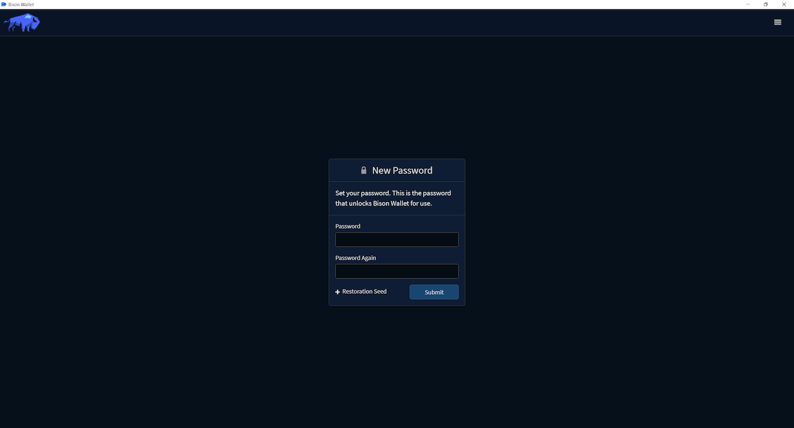

Setting your new client application password and clicking **Submit** will generate a new wallet. 
You will use this password to perform all future security-sensitive client operations.

## Restore Existing Seed

From the **New Password** prompt, you can also restore an existing application seed by clicking
in the **Restoration Seed** button and entering the seed backup phrase in the 12 word format.

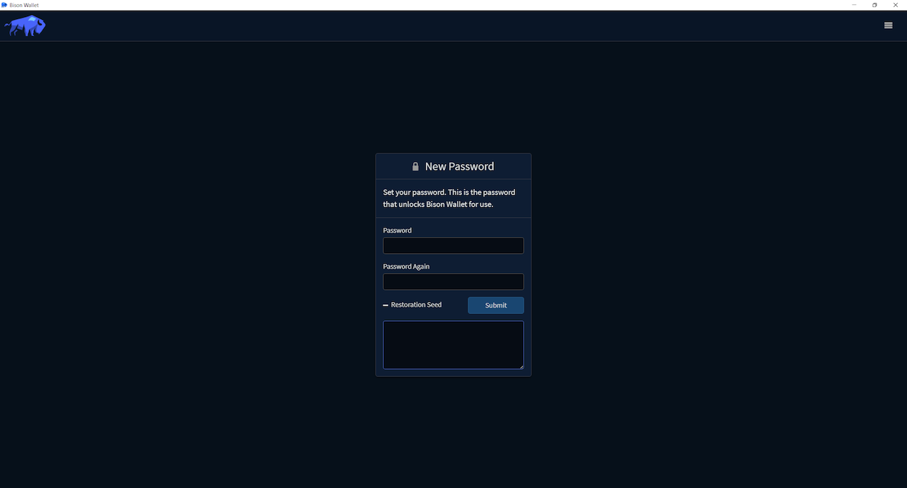

## Quick Configuration

The **Quick Configuration** wizard lets you select which [native wallets](TODO-NativeWallets) to create,
you can always create them later in the [Wallets](TODO-Wallets) tab.

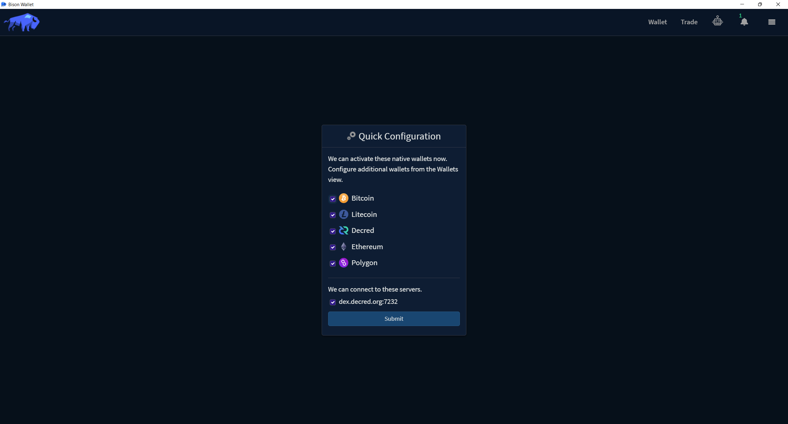

The selected native wallets will be created and Bison Wallet will connect to the selected 
DEX server when you submit the form.

_**Note:** If you encounter an error about not being able to connect to the selected DEX 
server during the quick configuration, you can always manually add a DEX server later through the settings
panel._

## Backup Application Seed

Once the selected [Native Wallets](TODO-NativeWallets) have been created as part of the **Quick Configuration** 
wizard, a prompt will appear to backup your application seed. This seed is used to restore your DEX 
accounts and any native wallets - so keep it safe. 

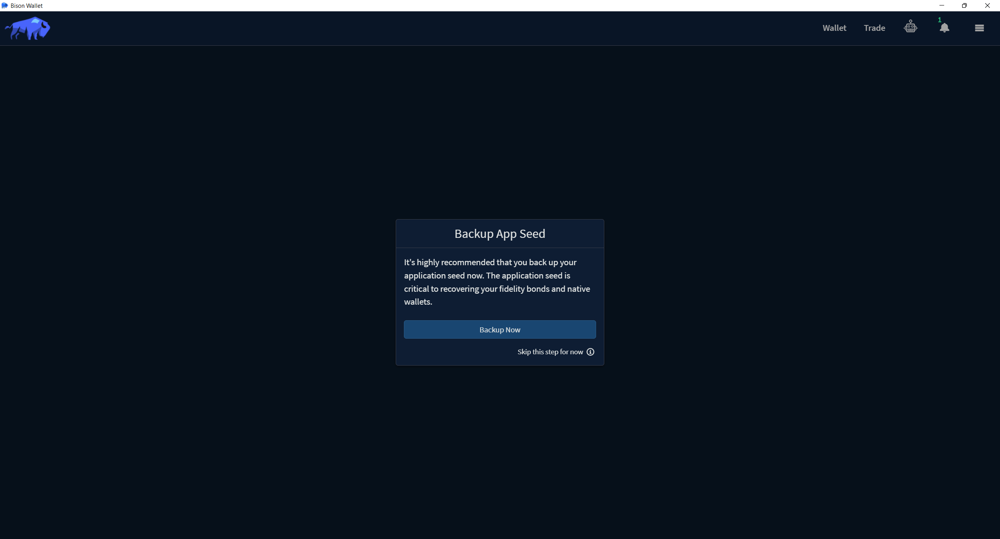

_**Note:** If you skip this step now (not recommended), you can go to the Settings panel to
retrieve your application seed later._

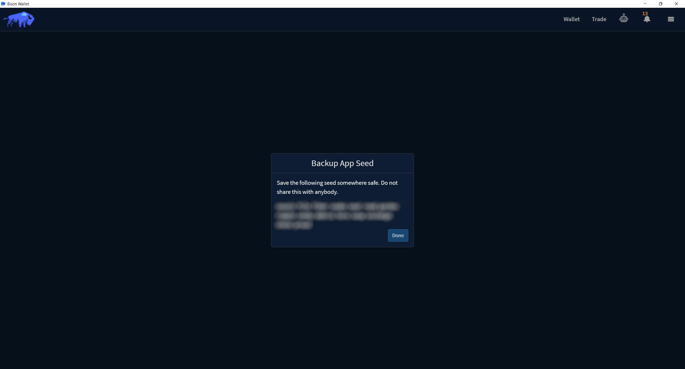

This seed phrase is essentially the private key for your native wallets. 
You will be able to use this seed phrase to restore your private keys, transaction history, 
and balances using Bison Wallet on any computer. This ultimately means that anyone who knows your 
seed can use it to restore your private keys, transaction history, and balances to Bison Wallet 
on their computer without your knowledge. For this reason, it is of utmost importance to keep your 
seed phrase safe. Treat this seed the same way you would treat a physical key to a safe. 
If you lose your seed phrase, you permanently lose access to your wallet and all funds within it. 
It cannot be recovered by anyone, including the Bison Wallet developers. It is recommended you write 
it down on paper and store that somewhere secure.  If you decide to keep it on your computer, 
it would be best to keep it in an encrypted document (do not forget the password) in case the file 
or your computer is stolen.
haha
_**DO NOT, UNDER ANY CIRCUMSTANCES, GIVE YOUR SEED TO ANYONE! 
NOT EVEN BISON WALLET OR DECRED DEVELOPERS!**_

## Wallet Synchronization

After the [Quick Configuration](#quick-configuration) wizard has been completed, the [Wallets](TODO-Wallets)
tab will be displayed, the Block Synch indicator on each wallet shows the progress as each blockchain
is synchronized.

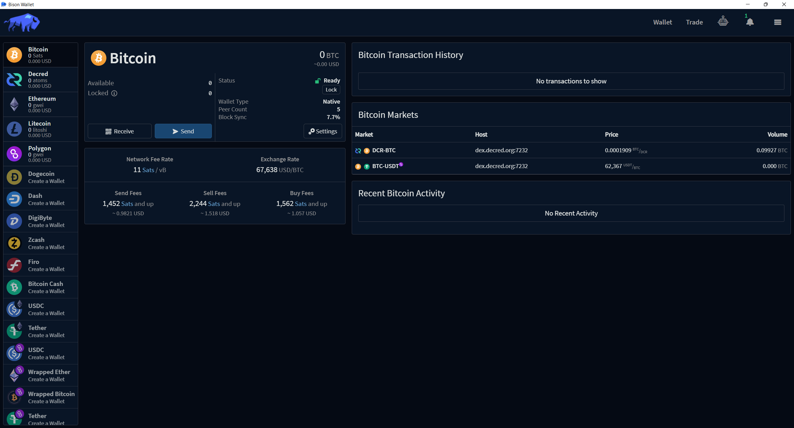

## Creating a DEX Server account

Clicking the **Trade** button in the header will navigate to the [Trading](TODO-trading) tab.

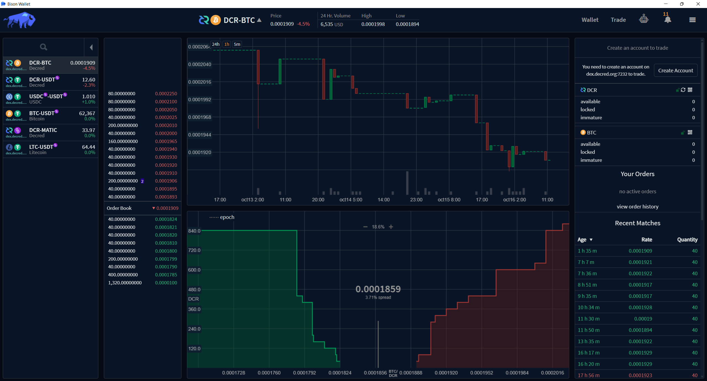

The available markets on the connected DEX servers are listed on the left side of the screen.

An account can be created with the respective server by clicking the **Create Account** button
on the top right of the screen. This will open the **Select Bond Asset** prompt.

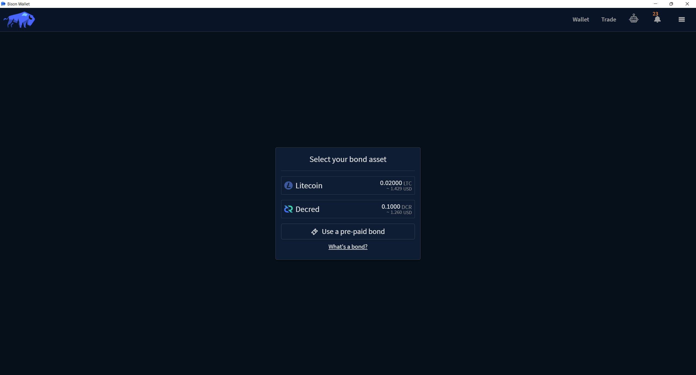

A fidelity bond are funds that are temporarily locked in an on-chain contract,
which is only redeemable by the user who posted the bond after a certain time.
Fidelity Bonds act as an incentive good behaviour on the DEX servers and are required for
creating an account on every server. Read more about bonds in the [Fidelity Bonds](TODO-bonds) 
section of this wiki.

Pre-paid bonds are codes generated by the server operator to enable temporary
trading access for individual users, once the pre-paid bond has expired, the user
will have to post a bond to maintain their trading tier. Pre-paid bonds are available
upon request in our [Matrix](https://matrix.to/#/#dex:decred.org) and 
[Discord](https://discord.com/channels/349993843728449537/454306570180886530) channels.

Once the bond asset is selected, a prompt to select the [Trading Tier](TODO-Tier) will appear.
Increasing your tier enables trading of larger quantities at a time. A higher tier also 
increase your capacity for violations before trading privileges are completely suspended.

Trading limits are also increased as you establish [reputation](TODO-reputation) by engaging 
in normal trading activity and successfully completing matches.

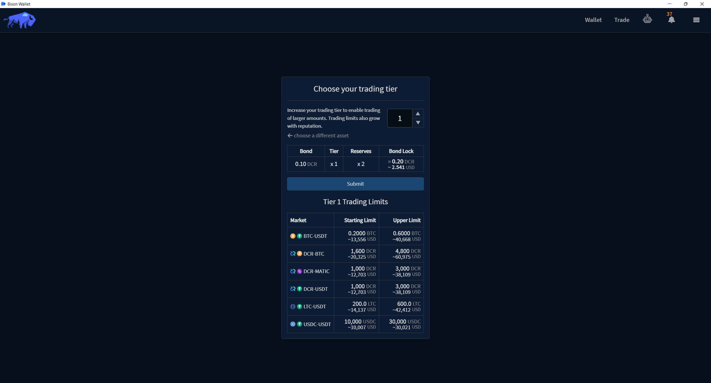

Clicking the **submit** button display a new prompt indicating the requirements for submitting 
a bond with the selected asset. The synchronization status and available funds, along with 
a deposit address for the selected bond asset.

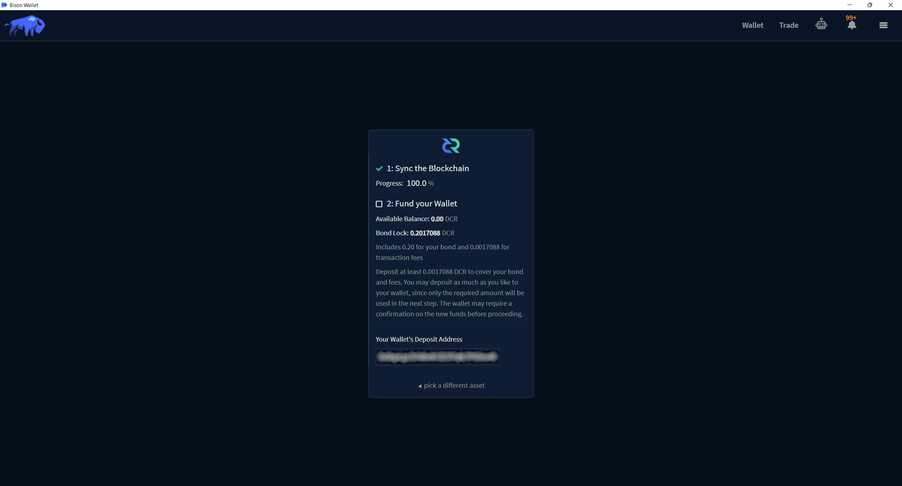

Once the wallet has synchronized and sufficient funds are available, a prompt will appear
to confirm the selected bond options.

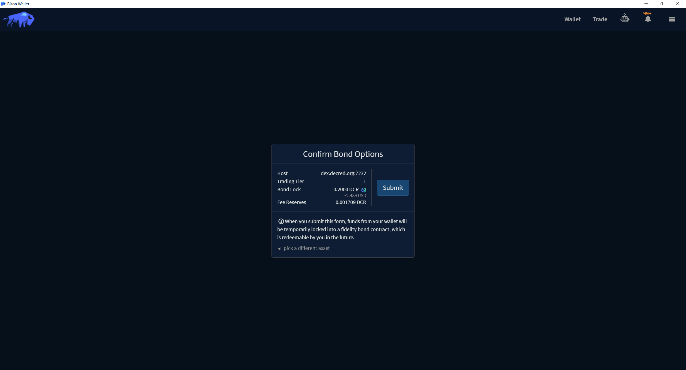

Clicking the **submit** button will temporarily lock the specified funds in a fidelity bond
contract, these funds are only redeemable by you in the future. 

The markets tab will be displayed once the form has been submitted. The status of the submitted
bond transaction will be indicated on the top right. The number of required confirmations will vary 
depending on the selected bond asset.

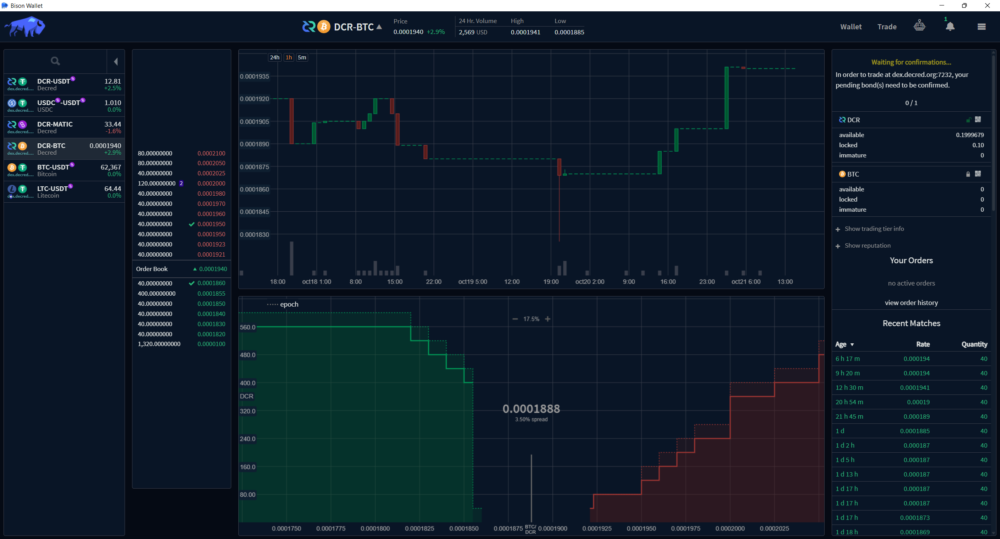

Once the bond transaction has been confirmed, the order submission section will be visible in the
top right of the markets tab.

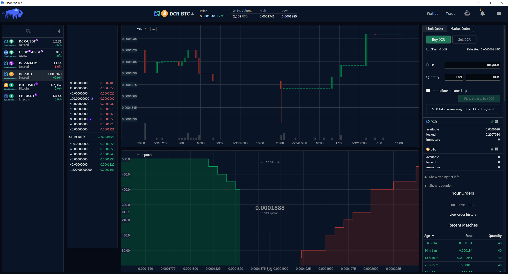

---

Next: [Using Bison Wallet](TODO)