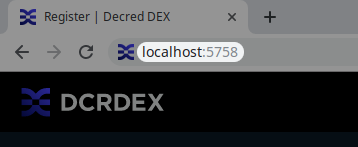
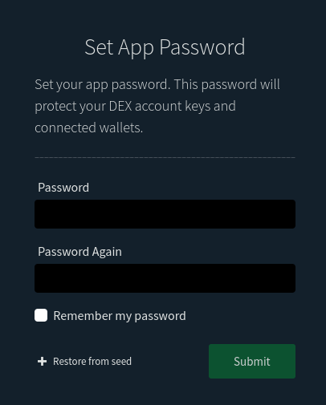
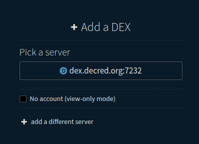
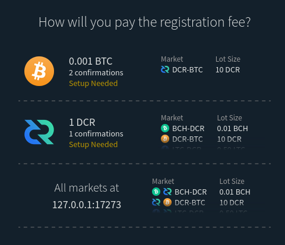
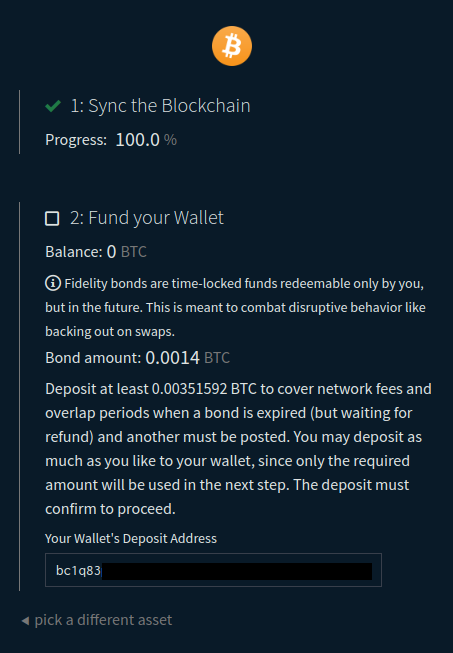
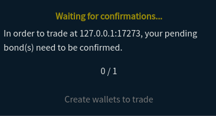
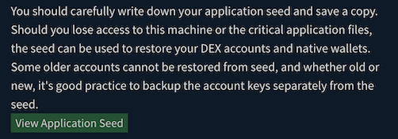

## Client Quick Start Installation

The DEX client can be installed in one of the following ways:

1. Download the the standalone DEX client for your operating system for the
   [latest release on GitHub](https://github.com/decred/dcrdex/releases).
2. [Use Decrediton](https://docs.decred.org/wallets/decrediton/decrediton-setup/),
   the official graphical Decred wallet, which integrates the DEX client, and go
   to the DEX tab.
3. Use the Decred command line application installer, [**dcrinstall**](https://docs.decred.org/wallets/cli/cli-installation/),
   with the `--dcrdex` switch.
4. Build the standalone client [from source](https://github.com/decred/dcrdex/wiki/Client-Installation-and-Configuration#advanced-client-installation).

**WARNING**: If you decide to build from source, use the `release-v0.5` branch,
not `master`.

### Sync Blockchains

Full nodes are NOT required to use DEX with BTC, DCR, or LTC. For Bitcoin, you
can choose to create a native (built into the DEX client) BTC wallet by choosing
the "Native" wallet type in the DEX client dialogs. A native DCR wallet is also
available, but you may use Decrediton or dcrwallet running in SPV (light) mode
for a more full-featured Decred wallet.

NOTE: The upcoming Ethereum wallet is also a native wallet that uses the standard
[light ethereum subprotocol (LES)](https://github.com/ethereum/devp2p/blob/master/caps/les.md).
However, ETH trading is not enabled in the current release and the wallet is not
available in the default build.

Both LTC and BTC support external Electrum wallets, but this option is less
mature and provides less privacy than the other wallet types. Be sure the wallet
is connected to and synchronized with the network first, only the
"default_wallet" is loaded, and its RPC server is configured
([example](images/electrum-rpc-config.png)).

If you choose to use full node wallets, you must fully synchronize them with
their networks *before* running the DEX client. This refers to **dcrd**,
**bitcoind**, **litecoind**, etc. Note that Bitcoin Core and most "clones"
support block pruning, which can keep your blockchain storage down to a few GB,
not the size of the full blockchain. Also, for good network fee estimates, the
node should be running for several blocks.

### Important Notes on Wallets

- **If you already have Decrediton installed**, upgrade Decrediton before
  running **dcrinstall**.

- If using external wallet software (e.g. Decrediton, **dcrd**+**dcrwallet**,
  **bitcoind**, Electrum, etc.), they must remain running while the DEX client
  is running. Do not shut down, lock, unlock, or otherwise modify your wallet
  settings while the client is running.

- For Electrum, the wallet must be the "default_wallet". Only one Electrum
  wallet should be opened to ensure the correct one is accessed.

## Client Configuration

These instructions assume you've used the
[Client Quick Start Installation](#client-quick-start-installation). If you've
used a [custom installation](#advanced-client-installation) for the client
and/or blockchain software, adapt as necessary.

### Prerequisites

External wallet software is not required for all assets. The native light
wallets are the simplest and best option for most users. But if using external
wallets, they should be running and synced before starting DEX. See the next
section for a list of supported wallets and assets.

Unless you use Decrediton to start DEX, you will need a web browser to open the
DEX client user interface as described in the next section.

### Optional External Software

Depending on which assets you wish to use, you have different choices for wallet
software. There are native/built-in light wallet options for Bitcoin and Decred,
an external light wallet option for Litecoin, and full-node support for all
other assets including: Bitcoin, Decred, Litecoin, ZCash, Dogecoin, Bitcoin
Cash. The following release will include Ethereum support with a native light
wallet.

1. **Bitcoin.** The native wallet has no prerequisites. To use a
   [Bitcoin Core](https://bitcoincore.org/en/download/) full node wallet
   (bitcoind or bitcoin-qt), the supported versions are v0.21, v22, and v23.
   Descriptor wallets are not supported in v0.21. An [Electrum
   v4.2.x](https://electrum.org/) wallet is also supported.
2. **Decred.** The native wallet has no prerequisites. Alternatively, Decrediton
   or the dcrwallet command line application may be used in either SPV or full
   node (RPC) mode. The latest Decrediton installer includes DEX. If using a
   standalone [dcrwallet](https://github.com/decred/dcrwallet), install from the
   [v1.7.x release binaries](https://github.com/decred/decred-release/releases),
   or build from the `release-v1.7` branches.
3. **Litecoin.** Either [Litecoin Core v0.21.x](https://litecoin.org/) or
   [Electrum-LTC v4.2.x](https://electrum-ltc.org/) are supported.
4. **Dogecoin.** [Dogecoin Core v1.14.5+](https://dogecoin.com/).
5. **ZCash.** [zcashd v5.1](https://z.cash/download/).
6. **Bitcoin Cash.** [Bitcoin Cash Node v24+](https://bitcoincashnode.org/en/)

### Initial Setup

1. Start the client. Either go to the "DEX" tab within Decrediton, or with the
   standalone client, open a command prompt in the folder containing the
   pre-compiled dexc client files and run `./dexc` (`dexc.exe` on Windows).

2. In your web browser, navigate to http://localhost:5758. Skip this step if
   using Decrediton.

   

3. Set your new **client application password**. You will use this password to
   perform all future security-sensitive client operations, including
   registering, signing in, and trading.

   

4. Choose the DEX server you would like to use. Either click one of the
   pre-defined hosts such as **dex.decred.org**, or enter the address of a known
   server that you would like to use.

   

   The above example shows a local server when in simnet mode (a developer network).

5. The DEX server will show all offered markets, and a choice of assets with
   which to pay the one-time setup fee. (This is a nominal amount just to
   discourage abuse and maintain a good experience for all users. No further
   fees are collected on trades.) Select the asset you wish to use.

   

6. Choose the type of wallet to use. In this screenshot, we choose a native BTC
   wallet and click "Create!". The wallet will begin to synchronize with the
   asset's network.

   

   NOTE: This is your own **self-hosted** wallet. The wallet's address keys are
   derived from the DEX application's "seed", which you may backup from the
   Settings page at any time.

7. The next form will show you synchronization progress, and give you the first
   deposit address for the wallet and the minimum amount you should deposit to
   be able to pay the fee. After sending to your address, the transaction **must
   confirm** (i.e. be mined in a block) before the form will update your
   balance. This form will be skipped if the wallet is already funded and
   synchronized.

   

   **IMPORTANT**: This is your own local wallet, and you can send as much as you
   like to the wallet since *only* the amount required for the fee will be spent
   in the next step. The remaining balance will be available for trading or may
   be withdrawn later. In the case of the screenshot above, the form indicates
   that for the client to make a fee payment transaction for the amount 0.001
   BTC, the wallet should be funded with "at least 0.00100823 BTC to also cover
   network fees".  For example, you can send yourself 5 BTC and only the
   required amount will be spent on the registration fee, with the remainder in
   the wallet's balance, which can then be traded or sent to another wallet.
   Since this fee estimate can change as network conditions fluctuate, you
   should deposit as much as you wish to trade.

8. Once the wallet is synchronized and has at least enough to pay the server's
   defined fee, the form will update, and you should click the button to submit
   the registration request and transmit the fee amount.

   

9. You will then be taken to the **markets view**, where you must wait for
   confirmations on your registration fee transaction generated in the previous
   step, at which time your client will automatically complete authentication
   with that server.

   

   Note the remainder of the 5 BTC deposited in the available balance after the
   fee was paid.

   While waiting, you may create additional wallets either directly from the
   displayed market or on the Wallets page accessible from the navigation bar at
   the top. This is also a good time to retrieve your application "seed", as
   described in the next step.

10. At any time you can go to the Settings page via the "gears" icon in the top
    navigation bar to retrieve the application seed that was generated when
    initializing the application in the first dialog. This seed is used to
    restore your DEX accounts and any native wallets, so keep it safe.

    

11. That's it! Use the Buy/Sell form on the Markets page to begin placing
   orders. Go to the Wallets page to obtain addresses for your wallets so that
   you can send yourself funds to trade.

## Advanced Client Installation

### Dependencies

1. [Go 1.18 or 1.19](https://golang.org/doc/install)
2. [Node 16 or 18](https://docs.npmjs.com/downloading-and-installing-node-js-and-npm) is used to bundle resources for the browser interface. It's important to note that the DEX client has no external JavaScript dependencies. The client doesn't import any Node packages. We only use Node to lint and compile our own JavaScript and css resources.
3. At least 2 GB of available system memory.

### Build from Source

**Build the web assets** from *client/webserver/site/*.

Bundle the CSS and JavaScript with Webpack:

```
npm clean-install
npm run build
```

**Build and run the client** from *client/cmd/dexc*.

```
go build
./dexc
```

Connect to the client from your browser at `localhost:5758`.

While `dexc` may be run from within the git workspace as described above, the
`dexc` binary executable generated with `go build` and the entire `site` folder
may be copied into a different folder as long as `site` is in the same directory
as `dexc` (e.g. `/opt/dcrdex/dexc` and `/opt/dcrdex/site`).

### Docker

**Build the docker image**

```
docker build -t user/dcrdex -f client/Dockerfile .
```

**Create docker volume**

```
docker volume create --name=dcrdex_data
```

**Run image**

```
docker run -d --rm -p 127.0.0.1:5758:5758 -v dcrdex_data:/root/.dexc user/dcrdex
```
