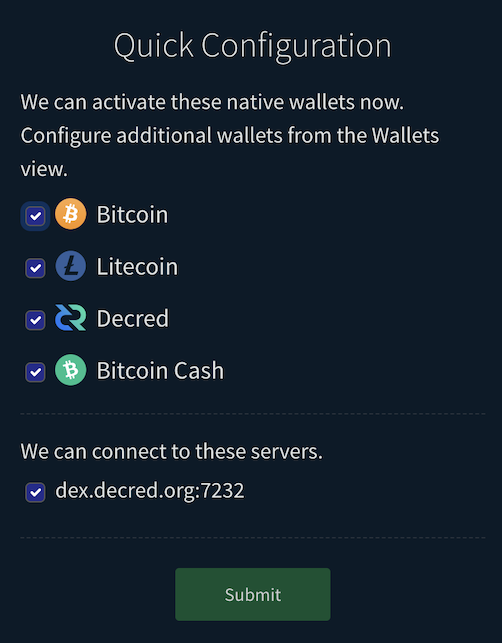

# Client Installation and Configuration

## Client Quick Start Installation

Bison Wallet can be installed in one of the following ways. Download the
application from *just one* of the following locations:

* Download standalone Bison Wallet for your operating system for the [latest
  release on GitHub](https://github.com/decred/dcrdex/releases). Extract the
  "bw" executable from the archive and run it. Open any web browser to the
  link shown by the application. You may also put the **bisonw** executable's
  folder on your `PATH`.
* [Use Decrediton](https://docs.decred.org/wallets/decrediton/decrediton-setup/),
  the official graphical Decred wallet, which integrates Bison Wallet, and go
  to the DEX tab.
* (Legacy users) Use the Decred command line application installer,
  [**dcrinstall**](https://docs.decred.org/wallets/cli/cli-installation/). This
  is no longer recommended.
* Build the standalone client [from source](https://github.com/decred/dcrdex/wiki/Client-Installation-and-Configuration#advanced-client-installation).

**WARNING**: If you decide to build from source, use the latest release branch,
not `master`.

### Important Note on External Wallets

If using external wallet software (e.g. **dcrd**+**dcrwallet**, **bitcoind**,
Electrum, etc.), they must remain running while Bison Wallet is running. Do
not shut down, lock, unlock, or otherwise modify your wallet settings while the
client is running. Also, only send funds from within the DEX application, not
directly from the external wallet's own controls. Finally, do not manually lock
or unlock any coins while Bison Wallet is running.

## Client Configuration

These instructions assume you've obtained Bison Wallet as described in the
[Wallet Quick Start Installation](#client-quick-start-installation) section.

### Prerequisites

If you use the standalone Bison Wallet, you will need a web browser to open
Bison Wallett user interface as described in the next section.

Most users will use the native wallets that are already built into the DEX
client. Depending on the asset, you may be able to choose from: (1) a native
wallet, (2) an external full node wallet, or (3) an Electrum-based wallet.
Consult the following table for a summary of wallet support. If there is a
checkmark in the "native" column, no external software is required.

| Coin         | native | full node | Electrum | notes                        |
|--------------|--------|-----------|----------|------------------------------|
| Bitcoin      |    ✓   | [v27.0](https://bitcoincore.org/en/download/) | [v4.5.5](https://electrum.org/) |                              |
| Decred       |    ✓   | [v2.0.3](https://github.com/decred/decred-release/releases) |     x    |                              |
| Ethereum     |    ✓   | geth IPC/http/ws |   N/A   |  see <https://github.com/decred/dcrdex/wiki/Ethereum>   |
| Litecoin     |    ✓   | [v0.21.2.1](https://litecoin.org/) | [v4.2.2](https://electrum-ltc.org/) | |
| Bitcoin Cash |    ✓   | [v27.0.0](https://bitcoincashnode.org/) |     x    | use only Bitcoin Cash Node for full node |
| Dogecoin     |    x   |  [v1.14.7.0](https://dogecoin.com/) |     x    |                              |
| Zcash        |    x   |   [v5.4.2](https://z.cash/download/)  |     x    |                              |
| Dash         |    x   |  [v20.1.1](https://github.com/dashpay/dash/releases)  |     x    | |
| Firo         |    x   | [v0.14.13.3](https://github.com/firoorg/firo/releases) | [v4.1.5.5](https://github.com/firoorg/electrum-firo/releases) | |

NOTE: The Electrum option is less mature and provides less privacy than the
other wallet types. Some manual configuration of the Electrum wallet's RPC
server is also necessary ([example](images/electrum-rpc-config.png)).

### Synchronizing Wallets

**If using the native wallets** that are integrated with Bison Wallet (see
above), you can skip this section.

If you choose to use an external wallet (full node or Electrum), you must start
and synchronize them with their networks *before* running Bison Wallet.

Note that Bitcoin Core and most "clones" support block pruning, which can keep
your blockchain storage down to a few GB, not the size of the full blockchain,
but a large size should be used to avoid full reindexing if used infrequently.
Also, for good network fee estimates, the full node should be running for
several blocks.

### Initial Setup

1. Start the client. For installed versions, open through your system applications menu.
   For standalone Bison Wallet (**bisonw**), open a command prompt
   in the folder containing the bisonw application and run it. e.g. `./bisonw` on
   Mac and Linux, or `bisonw.exe` on Windows. To avoid the command prompt on
   Windows, `bisonw-tray.exe` may be run instead. If using Decrediton instead of
   **bisonw**, just click the "DEX" tab and skip to step 3.

   **Note**: You can start bisonw with another network via a command line flag:
   `--testnet` or `--simnet`, the default is `mainnet`.

2. In your web browser, navigate to <http://localhost:5758>. Skip this step if
   using Decrediton.

   

3. Set your new **client application password**. You will use this password to
   perform all future security-sensitive client operations.

   

   NOTE: Checking the "Remember my password" box only applies to the current
   session. It is easiest for most users to have it checked.

4. After creating your app password, you'll be taken to the `Quick Configuration` form:

   

   The selected native wallets will be created for you and you'll be connected
   to the selected DEX server when you submit the form.

   **Note**: If you encounter an error about not being able to connect to the
   selected DEX server during the quick configuration, you can manually [add the DEX server](https://github.com/decred/dcrdex/wiki/DEX-Trading-Account-Management#adding-a-dex-trading-account). You will see a list of known DEX server(s) you can choose from.

5. Backup your app seed. This seed is used to restore your DEX accounts and any
   native wallets, so keep it safe.

   If you skip this step now (not recommended), you can go to the Settings view
   via the "gears" icon in the top navigation bar to retrieve your application
   seed later.

    

6. That's it! You'll be redirected to the wallets page after step 4 above.

7. To start trading, follow the guide to [Setting Up Your DEX Trading
   Account](https://github.com/decred/dcrdex/wiki/DEX-Trading-Account-Management).

## Advanced Client Installation

### Dependencies

1. [Go 1.19 or 1.20](https://golang.org/doc/install)
2. (optional) [Node 18 or 20](https://docs.npmjs.com/downloading-and-installing-node-js-and-npm) is used to bundle resources for the browser interface. It's important to note that Bison Wallet has no external JavaScript dependencies. The client doesn't import any Node packages. We only use Node to lint and compile our own JavaScript and css resources. This build step is not required if building from a release branch such as `release-v0.6`.
3. At least 2 GB of available system memory.

### Build from Source

**Build the web assets** from *client/webserver/site/*.

**If building from the `master` branch,** bundle the CSS and JavaScript with Webpack:

```sh
npm clean-install && npm run build
```

**Build and run the client** from *client/cmd/bisonw*.

```sh
go build
./bisonw
```

Connect to the client from your browser at `localhost:5758`.

While `bisonw` may be run from within the git workspace as described above, the
`bisonw` binary executable generated with `go build` can be copied into a
different folder (e.g. `/opt/dcrdex/bisonw`).

### Docker

#### Build the docker image

```sh
docker build -t user/dcrdex -f client/Dockerfile .
```

#### Create docker volume

```sh
docker volume create --name=dcrdex_data
```

#### Run image

```sh
docker run -d --rm -p 127.0.0.1:5758:5758 -v dcrdex_data:/root/.bisonw user/dcrdex
```
