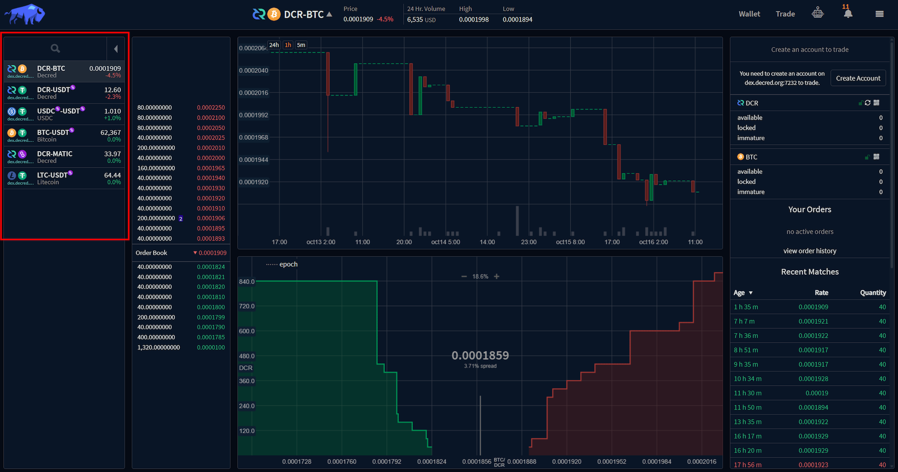
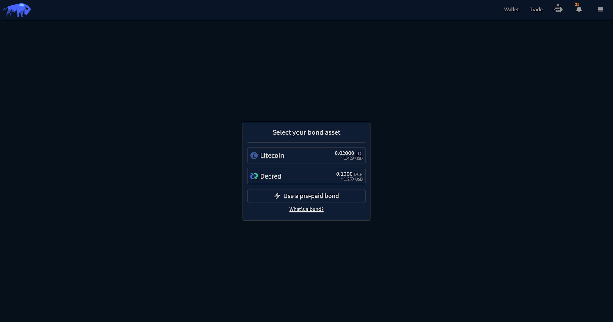
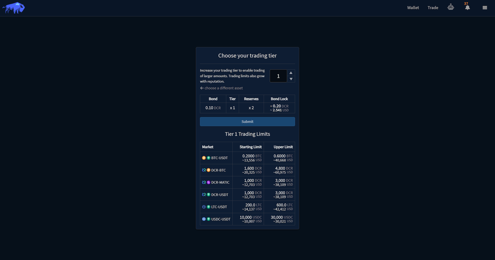
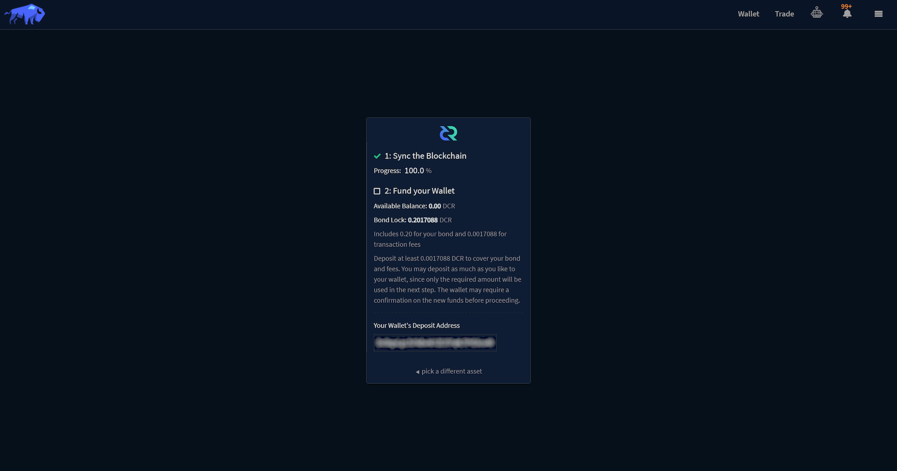
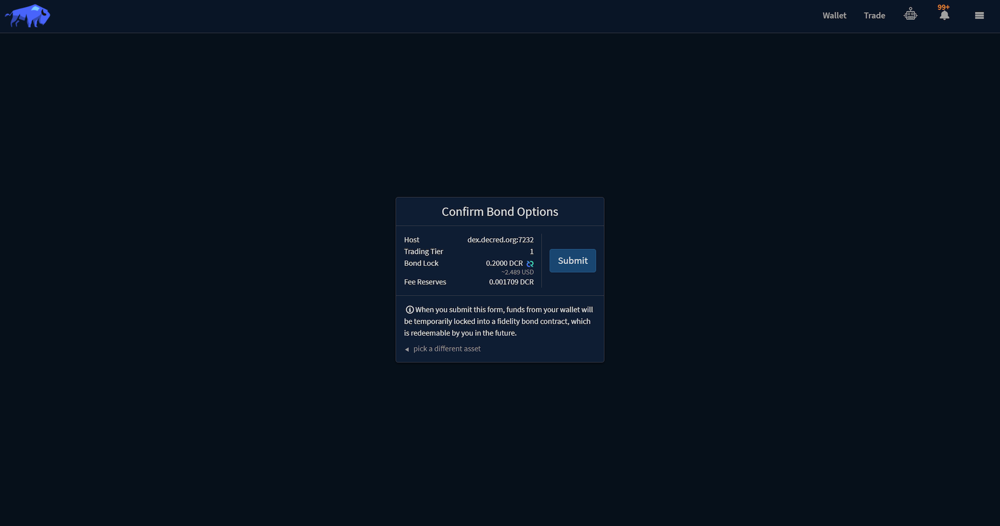
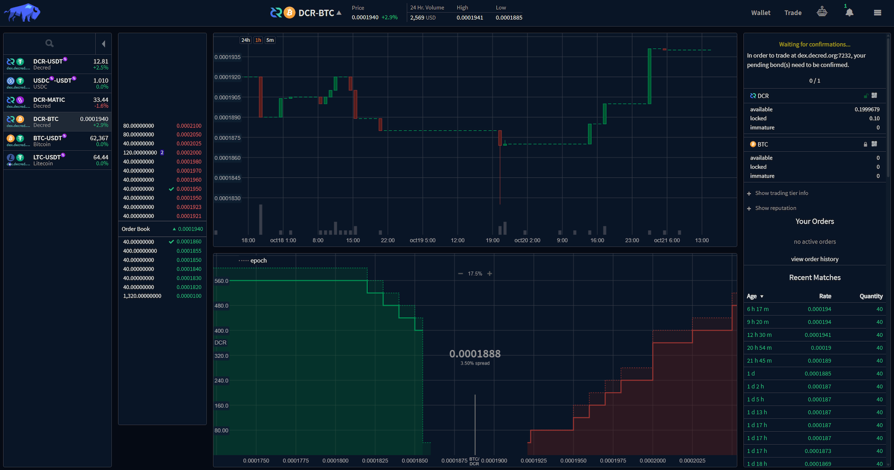
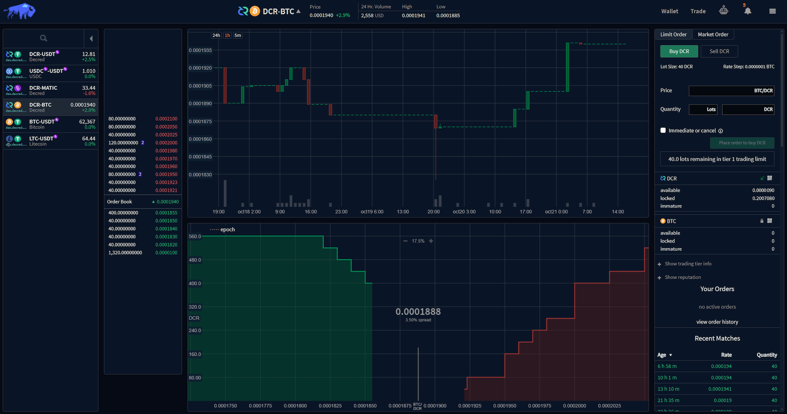

_Last updated for Bison Wallet v1.0.0._

## Contents

- [Create Account](#create-account)
- [Fidelity Bonds](#fidelity-bonds)
  - [Pre-paid Bonds](#pre-paid-bonds)
- [Bond Submission](#bond-submission)

This guide assumes you have already [downloaded and installed](Download-and-Install) Bison Wallet,
and ran the [Quick Configuration](Quick-Configuration).

# Create Account

Clicking the `Trade` button in the header will navigate to the [Trade](Trade) view.
The available markets on the connected DCRDEX servers are listed on the left side of the screen.

An account can be created with the respective server by clicking the `Create Account` button
on the top right of the screen.

This will open the `Select Bond Asset` prompt.

# Fidelity Bonds

A fidelity bond are funds that are temporarily locked in an on-chain contract,
which is only redeemable by the user who posted the bond after a certain time.
Fidelity Bonds act as an incentive for good behaviour on the DCRDEX servers and are required for
creating an account on every server.

## Pre-paid Bonds

Pre-paid bonds are codes generated by the DCRDEX server operator to enable temporary
trading access for individual users, once the pre-paid bond has expired, the user
will have to post a bond to maintain their trading tier.

> [!NOTE]
> Pre-paid bonds are available upon request in our [Matrix](https://matrix.to/#/#dex:decred.org) and
[Discord](https://discord.com/channels/349993843728449537/454306570180886530) channels.

# Bond Submission

Once the bond asset is selected, a prompt to select the
[Trading Tier](Managing-your-DCRDEX-Accounts#changing-trading-tier) will appear.
Increasing your tier enables trading of larger quantities at a time. A higher tier also
increase your capacity for violations before trading privileges are completely suspended.

Trading limits are also increased as you establish
[reputation](Managing-your-DCRDEX-Accounts#reputation-score) by engaging
in normal trading activity and successfully completing matches.

Clicking the `Submit` button displays a new prompt indicating the requirements for submitting
a bond with the selected asset, the synchronization status and available funds, along with
a deposit address for the selected bond asset.

This is your own wallet, and you can send as much as you like to it since only the amount
required for the bond will be spent in the next step. The remaining amount, minus a small
reserve for future bond transactions, will be in your available balance.

For example, you can send yourself 5 DCR and only the required amount
(0.10 DCR in the case pictured above) will be spent to create the bond in the next step,
with an equivalent amount plus fees in reserves. The remainder goes to your available balance,
which can then be traded, sent, or simply held in the wallet.

Once the wallet has synchronized and sufficient funds are available, a prompt will appear
to confirm the selected bond options.

Clicking the `Submit` button will temporarily lock the specified funds in a fidelity bond
contract, these funds are only redeemable by you in the future.

The trade view will be displayed once the form has been submitted. The status of the submitted
bond transaction will be indicated on the top right. The number of required confirmations will vary
depending on the selected bond asset.

Once the bond transaction has been confirmed, the order submission section will be visible in the
top right of the markets tab.

It is recommended to export your DCRDEX account information whenever they are created since your bonds
are not automatically restored from just the application seed, refer to the
[Export DCRDEX Account](Managing-your-DCRDEX-Accounts#export-dcrdex-account) section of this wiki for
more information.

---

Next Section: [Using Bison Wallet](Using-Bison-Wallet)

[⤴ Back to Top](#top)
