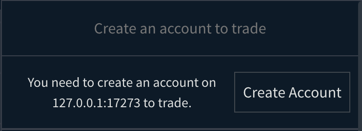
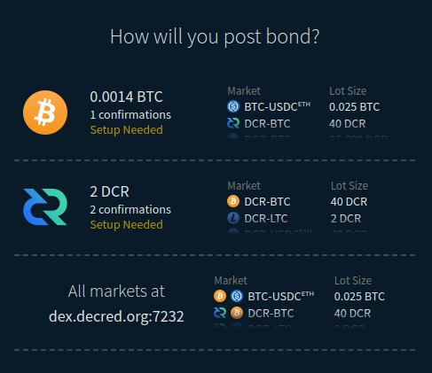
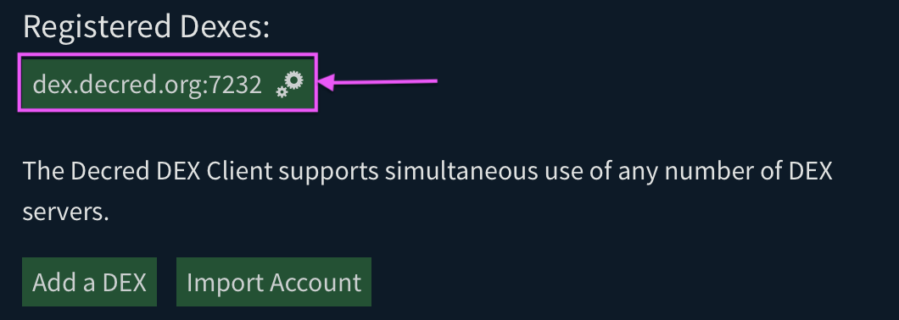
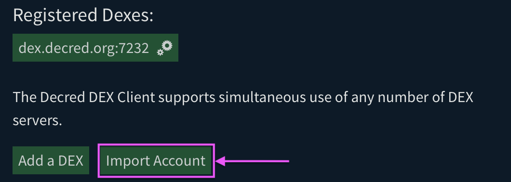
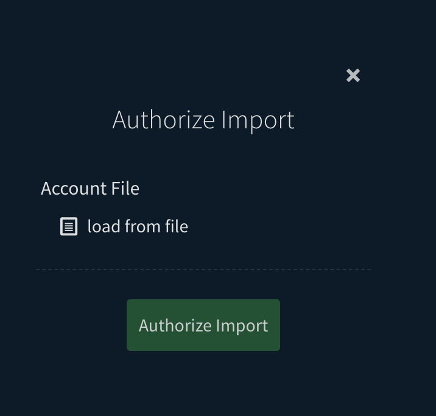
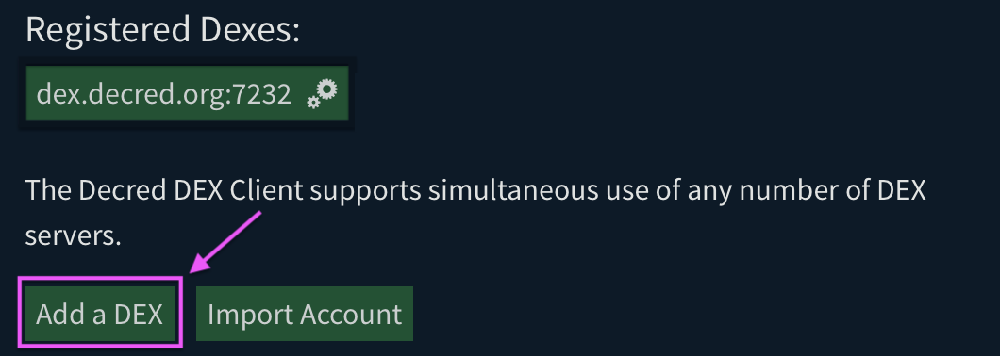
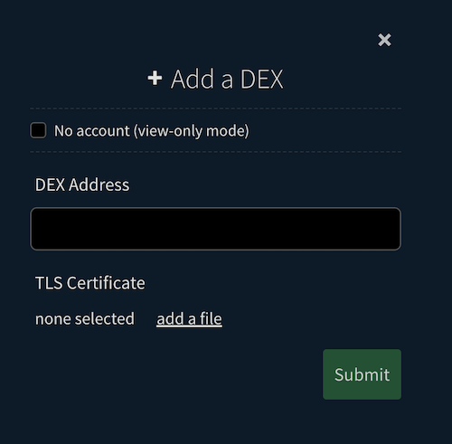

# Guide to Managing Your DEX Trading Account

In this guide, we will discuss how you can manage your DEX Trading Account.

Let's get started!

## Prerequisites

This guide requires that you've followed the steps in the [Initial Setup
Guide](https://github.com/decred/dcrdex/wiki/Client-Installation-and-Configuration#initial-setup)
or you've already setup Bison Wallet. If not, please do before proceeding.

## Setting Up Your DEX Trading Account

Before you can start buying and selling on Decred DEX, you'll need a DEX trading
account.

1. Go to the `Markets` Page.
2. Find the `Create Account` button and click it.

    

3. The DEX host will show all offered markets, and a choice of assets with which
   you can lock in a bond to enable trading. Select the asset you wish to use.

   

   **NOTE**: A dedicate wiki page describing time-locked fidelity bonds will be
   created, but in short, fidelity bonds are funds redeemable only by you, but
   in the future. Having a potential trader lock some amount of funds before
   placing orders is an anti-spam mechanism to combat disruptive behavior like
   backing out on swaps.

4. If you already created the selected asset wallet, you'll **skip this step**.
   Choose the type of wallet to use. In this screenshot, we choose a native BTC
   wallet and click "Create!". The wallet will begin to synchronize with the
   asset's network.

   

5. The next form will show you synchronization progress, and give you the
   deposit address for your wallet and the minimum amount you should deposit to
   be able to create your first bond in the next step, which is required to
   place orders. After sending to your address, the transaction **must confirm**
   (i.e. be mined in a block) before the form will update your balance. This
   form will be skipped if the wallet is already funded and synchronized.

   

   **IMPORTANT**: This is your own wallet, and you can send as much as you
   like to it since *only* the amount required for the bond will be spent in the
   next step. The remaining amount, minus a small reserve for future bond
   transactions, will be in your available balance. For example, you can send
   yourself 5 BTC and only the required amount (0.0014 BTC in the case pictured
   above) will be spent to create the bond in the next step, with an equivalent
   amount plus fees in reserves. The remainder goes to your available balance,
   which can then be traded, sent, or simply held in the wallet.

   You may disable future bonds at any time by changing the "Target Tier" to 0
   in the "Update Bond Options" form accessible from DEX host settings form
   accessible from the Settings view. This will return any reserves to the
   available balance. Any active bonds will automatically be refunded when their
   lock time expires (currently 2 months after creation).

   **NOTE**: The native Litecoin and Bitcoin Cash wallets connect to full nodes on
   the blockchain network that have "compact block filters" enabled. It may take
   time for the wallet to crawl the network until it finds such nodes. Be
   patient; otherwise you can bootstrap the process using a known seed node such
   as the Litecoin nodes on [this list](https://gist.github.com/chappjc/d0f26b12258f8531bb78b37f38d080a0).

6. Once the wallet is synchronized and has at least enough to create your
   time-locked fidelity bond, the form will update, and you should click the
   button to create and broadcast your bond transaction.

   

   After proceeding, the available balance will be the amount you deposited
   in the previous step minus this bond amount and transaction fees.

7. You will then be taken to the **Markets** page, where you must wait for
   confirmations on your bond transaction:

   

   While waiting, you may create additional wallets either directly from the
   displayed market or on the Wallets page accessible from the navigation bar at
   the top.

   After the transaction is confirmed, the application will submit the bond for
   validation and you will be ready to trade:

   

   It is recommended to export bond information whenever they are created since
   they are not automatically restored from just the application seed,
   [Exporting your DEX Trading Account](#exporting-your-dex-trading-account)
   section will show you how to. If you restore from seed in the future: create
   the same wallets, add the same DEX host, and *then* import the bonds from
   this backup.

   That's it! Use the Buy/Sell form on the Markets page to begin placing
   orders. Go to the Wallets page to obtain addresses for your wallets so that
   you can send yourself funds to trade.

## Exporting your DEX Trading Account

If you want to use your DEX trading account bond(s) on another device, you'll
need to export it. Here's how you can do it:

1. Go to the `Settings` Page.
2. Click on the DEX account in the `Registered Dexes` list. In this example, it
   will be `dex.decred.org:7232 ⚙️`

    

3. On the DEX account settings view, click `Export Account`.
4. Select the directory where you want to save the `.json` file. Make sure to
   keep your exported account file safe.

## Importing an existing DEX Trading Account

If you have an existing DEX account that you want to use with a new setup,
here's how you can do it:

1. Go to the `Settings` Page.
2. Click on `Import Account`.

    

3. Choose the exported DEX account `.json` file by clicking on `load from file`.

    

4. Click `Authorize Import`.

Easy as that!

## Disabling a DEX Trading Account

If you want to temporarily disable your DEX trading account, follow these steps:

1. Visit the DEX account settings as in [Exporting your DEX Trading Account](#exporting-your-dex-trading-account)(**Step 1 and 2**).
2. On the selected DEX account settings view, click on the `Disable Account`.
3. Confirm the action with your app password.

If successful, the DEX trading account **will not be listed until it is added again**.

**Note**: Keep in mind that you can't disable your account if you have active
orders or unspent bonds.

## Adding a DEX Trading Account

To add a new DEX server:

1. Go to the `Settings` page.
2. Click on `Add a DEX`.

    

3. Enter the address a known DEX server that you would like to use. and select
   the DEX server TLS file after clicking on `add a file`.

    

   **NOTE**: If you just want to view the markets without being able to trade,
   check the "No account" box. You will have an opportunity to create an
   identity later, but if you are ready to trade [follow the remaining
   steps](#setting-up-your-dex-trading-account).

   If you had an account with the newly added DEX server, it'll be automatically
   discovered and enabled but you you'll need to create fidelity bonds to trade
   with your account.

## Managing your DEX Trading Account Tier

To manage your DEX trading account tier, here's what you need to do:

1. Visit the DEX account settings as in [Exporting your DEX Trading Account](#exporting-your-dex-trading-account)(**Step 1 and 2**).
2. On the DEX account settings view, click `Update Bond Options`.
3. Choose the asset for your fidelity bonds and set your `Target Tier`.
4. Click `Submit` to update your bond options.

**Note**: Make sure you have enough funds to cover your `Target Tier`.

## Wrapping Up

That's it! You've learned how to manage your DEX Trading Account.

While this guide covers the basics, there are more advanced topics like updating
DEX hosts and TLS certificates. But for now, you're ready to dive into the
exciting world of DEX trading!

## Glossary

- **Fidelity Bonds**: These are locked funds redeemable by you in the future.
They help prevent disruptive behavior in trades like backing out on swaps.
- **Target Tier**: This is the target account tier you wish to maintain.
Set to zero if you wish to disable tier maintenance (i.e do not post new bonds).
