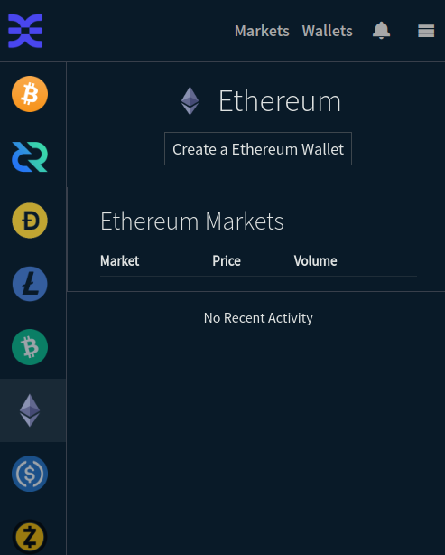
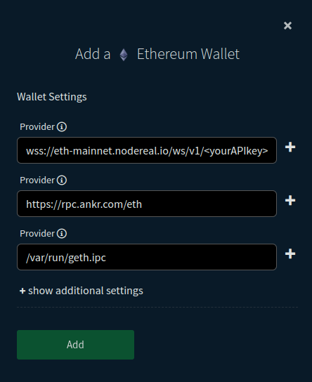

# Ethereum

## Wallet Overview

The Ethereum wallet in Bison Wallet is similar to the "native" wallets for BTC
and DCR, but requires some manual configuration.

Like the other native wallets, the private keys (and accounts) are derived from
the DEX "application seed", so that reinitializing the DEX app from seed will
restore the same Ethereum wallet and any ERC20 wallets. The keys are maintained
exclusively by the application process, and all transaction signing is handled
by the application.

Unlike the other native wallets, the Ethereum wallet uses "RPC providers"
specified by the user. This is the wallet's gateway to the Ethereum network.
Casual ETH users may be familiar with Infura, as an example, since this is the
default provider for the common MetaMask wallet. When creating your Ethereum
wallet in the DEX application, you will need to specify the full path to an
Ethereum RPC provider, i.e. an RPC endpoint. See the [RPC Provider
List](#rpc-provider-list-partial) below for suggestions.

## Wallet Setup

From the "Wallets" page of the DEX application, you select Ethereum from the
left menu, which will show you your ETH balance if you already have a
wallet, or you will see a "Create a Ethereum Wallet" button:

   

When you click the button, you will be able to specify one or more RPC provider
endpoints. You can provide a single endpoint, but it is recommended to specify
more than one for redundancy. Click the "+" icon at the right to add additional
providers.

   

The types of endpoints that are supported are:

- (**Recommended**) WebSocket (ws:// or wss:///). These use a persistent
  connection, which is efficient and supports new block subscriptions to reduce
  provider utilization and bandwidth.
- HTTP (http:// or https://). These are less efficient and do not support new
  block subscriptions, so the client frequently polls for new blocks.
- IPC. These are typically a special file on your local machine. You must be
  running a local node to use this, and the IPC file permissions must be set to
  allow the DEX app to use it. However, typically even a full node will expose a
  WebSocket interface.

## RPC Provider Suggestions

Consider the following tips when configuring your Ethereum wallet:

- Use **multiple providers**, even if one of them is your own full node. This
  provides redundancy. Often a provider will fall behind or even stall, so
  use of multiple providers adds robustness to your wallet.

- Get a personal RPC endpoint, with your own **private API key**. Many providers
  will allow you to create a personal endpoint that includes an API "key" that
  is assigned just to you.
  
  This is important since all providers have request rate limits, which may be
  exhausted quickly with a generic RPC endpoint (e.g.
  <https://rpc.ankr.com/eth>) that enforce rate limiting based on the source IP
  address. This is particularly important if you use a VPN or other proxy where
  you share an outbound IP address with many other people.

  Further, taking the time to get an endpoint with your personal API key often
  gives you access to a "dashboard" with the provider so you can monitor your
  API requests.

- Use **WebSockets** (wss:// URL scheme) when using a third-party RPC provider.
  It is much more efficient than HTTP, the wallet will become aware of new
  blocks sooner, and it will consume less of your quota with the provider. The
  application may attempt a WebSocket connection even when given an HTTP
  endpoint, but it is best to specify it explicitly if it is known.

- Use a private full node for one of your endpoints, if you are able.

- Even if you use a private full node, use backup RPC providers! Running an
  Ethereum node is difficult. You will experience downtime when you least expect
  it.

## RPC Provider List (partial)

Some common Ethereum RPC providers are listed at <https://ethereumnodes.com/>.

A handful that we have tested:

- [NodeReal](https://dashboard.nodereal.io/) - personal API key, wss
- [Alchemy](https://www.alchemy.com/overviews/private-rpc-endpoint) - personal API key
- [LlamaNodes](https://llamanodes.com/) - personal API key, wss, web3 sign-in, no testnet
- [Rivet](https://rivet.cloud/) - personal API key, wss, web3 sign-in
- [Blast](https://blastapi.io/login?app=consumer) - personal API key, wss, web3 sign-in
- [OmniaTech](https://app.omniatech.io/dashboard/generate-endpoints) - personal API key, wss, web3 sign-in
- [Ankr](https://www.ankr.com/rpc/) - generic endpoint, often behind a few blocks, possibly http-only
- [Publicnode](https://ethereum.publicnode.com/) - generic endpoint, possibly http-only

[Infura](https://docs.infura.io/infura/reference/network-endpoints) is also
extremely reliable and common, but their data sharing and retention policy has
been under fire recently. Decide for yourself.

The Flashbots Protect RPC service is **not recommended** for the DEX wallet
since the public mempool is only used in certain circumstances, which is not
helpful for the DEX wallet. Further, Flashbots will abandon transactions that
are not mined within 6 minutes, and while it is expected that transactions will
be mined more promptly, this is not desirable.

Some providers allow you to sign in with a web3 wallet (e.g. MetaMask) to create
a personal API key and access a dashboard. This may be preferable to creating an
account with an email address.

## Wallet Recovery

The wallet's account and private keys are derived from the DEX "application
seed". This means that reinitializing the DEX application from this seed will
restore the same Ethereum wallet and any ERC20 wallets.

**WARNING: You should never interact with the Ethereum account outside of the
DEX application!**

**Do NOT** simultaneously use the account from multiple wallet programs,
including multiple installations of the DEX application with the same seed. Any
interaction other than simply viewing the balance while the DEX app is running
or there are active orders can interfere with trades and can lead to lost funds.
Such interactions include sending funds, cancelling or "speeding up"
transactions, or any other interaction that consumes gas or creates a new
transaction.

However, it is possible to export the account's private key for recovery outside
of the DEX application. Only in emergency recovery situations should you import
the private key into another wallet. Again, do not use the wallet outside of the
DEX application. If you feel you need to use the backup private key, or are
unable to reinitialize the DEX application with the same seed, please first seek
guidance in the [Decred chat](https://matrix.to/#/#dex:decred.org).
