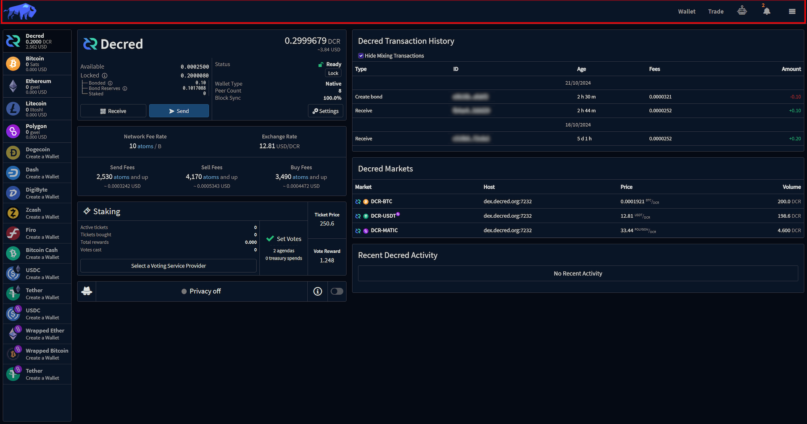
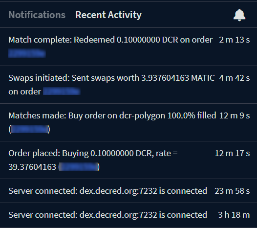

_Last updated for Bison Wallet v1.0.0._

**Contents**

- [Notifications Panel](#notifications-panel)
  - [Notifications Tab](#notifications-tab)
  - [Recent Activity Tab](#recent-activity-tab)
- [Language Switching](#language-switching)
- [Settings Panel](#settings-panel)

This page is part of the [Using Bison Wallet](Using-Bison-Wallet) guide, it assumes you have already
set up a Bison Wallet using the [Getting Started Guide](Getting-Started).

The Header is displayed at the top of the window, and it is used to access
the different features Bison Wallet offers.

---

# Notifications Panel

The notifications' panel can be opened by clicking the notifications icon
on the [header](#header).

## Notifications Tab

The notifications tab displays important updates, alerts, and other actionable information related
your wallets, transaction and DCRDEX accounts.

## Recent Activity Tab

The Recent Activity tab displays lower severity notifications that are not persistent across sessions.

# Language Switching

Language Switching can be accessed by clicking the hamburger menu in the [header](#header).

The first line indicates the current language, while the second has the different options for
selection.

In the example above, the current language is set to ``English``, while clicking the
 button
will change the language to ``German``.

# Settings Panel

The Settings can be accessed by clicking the hamburger menu in the [header](#header).

The Settings panel is where you can change Bison Wallet from dark to light mode,
customize Fiat Exchange rate sources and configure desktop notifications.
You can also view your application seed, change your passphrase and
[manage your DCRDEX accounts](Managing-your-DCRDEX-Accounts).

---

Next Section: [Wallet](Wallet)

[⤴  Back to Top](#top)
