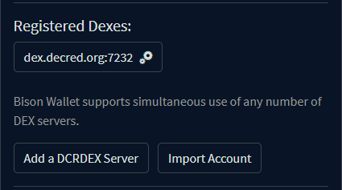
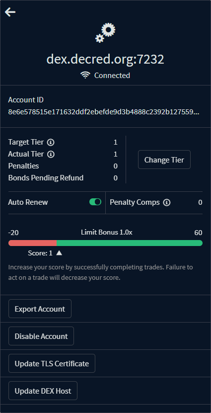
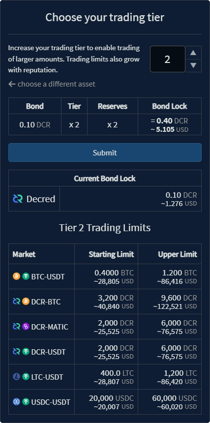
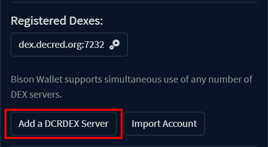
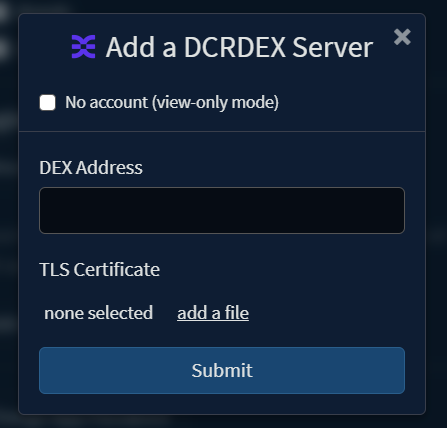
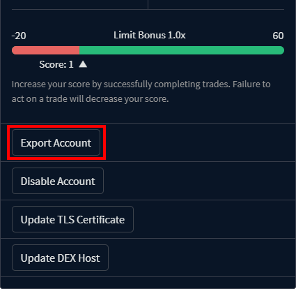
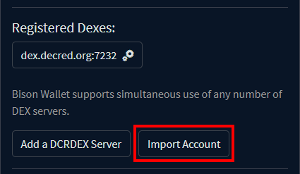
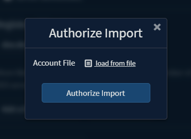

<a id="top"/>

_Last updated for Bison Wallet v1.0.0._

## Contents

- [Changing Trading Tier](#changing-trading-tier)
- [Reputation Score](#reputation-score)
- [Adding a new DCRDEX Server](#adding-a-new-dcrdex-server)
- [Export DCRDEX Account](#export-dcrdex-account)
- [Import DCRDEX Account](#import-dcrdex-account)

This page is part of the [Using Bison Wallet](Using-Bison-Wallet) guide, it assumes you have already
set up a Bison Wallet using the [Getting Started Guide](Getting-Started).

Account Management is located in the `Registered Dexes` section of the
[Settings Panel](Header#settings-panel).

Clicking on a registered server will open the Account Management panel.
In this example, it will be `dex.decred.org:7232 ⚙️`

- **Account ID:** your account identifier on the DCRDEX server.
- **Target Tier:**  This is the target account tier you wish to maintain.
This is set to zero when **Auto Renew** is disabled.
- **Actual Tier:** Reflects your account's current actual trading tier with the DCRDEX server,
determined based on your active [bonds](Creating-a-DCRDEX-Server-Account#fidelity-bonds)
and [reputation](#reputation-score) score.
- **Penalties:** the number of tiers that are currently revoked due to low user score.
- **Bonds Pending Refund:** expired bonds that are pending a refund transaction.
- **Auto Renew:** enable automatic bond renewal for the selected target tier.
- **Penalty Comps:** enable posting additional bonds to offset penalized tiers.
- **Score:** current [reputation](#reputation-score) score for the associated DCRDEX server account.

# Changing Trading Tier

Increasing your tier enables trading of larger quantities at a time. A higher tier also
increase your capacity for violations before trading privileges are completely suspended.
Trading limits are also increased as you establish [reputation](#reputation-score) by engaging
in normal trading activity and successfully completing matches.

Increasing your tier will require locking additional funds in a
[fidelity bond](Creating-a-DCRDEX-Server-Account#fidelity-bonds), while lowering it
will reduce the amount required to renew your tier once the current bonds expire.

# Reputation Score

Users are incentivized to respond with their preimage for their submitted orders and to complete
swaps as the match negotiation protocol specifies. If they fail to act as required, their account
will be penalized, with trading privileges eventually being completely suspended after multiple
[revoked matches](Order-Management#revoked-matches).

A suspended account will require time-locking additional funds on a new
[fidelity bond](Creating-a-DCRDEX-Server-Account#fidelity-bonds) to offset penalized tiers.
The DCRDEX scoring system has been designed to balance the need to deter intentional disruptions with the
reality of unreliable consumer networks and other such technical issues.

Your reputation score increases by successfully completing trades.
Misbehaviour and failure to act on a trade will penalize your score depending on the type of match failure:

| Action             | Score Penalty | Notes                                                 |
|--------------------|---------------|-------------------------------------------------------|
| No Redeem as Taker | - 1           | Counterparty not affected, no stuck funds.            |
| No Swap as Maker   | - 4           | Book spoof, taker needs a new order. No locked funds. |
| Excessive Cancels  | - 5           |                                                       |
| No Redeem as Maker | - 7           | Taker has funds stuck for 8 hours in contract.        |
| No Swap as Taker   | - 11          | Maker funds stuck for 20 hours in contract.           |

# Adding a new DCRDEX Server

DCRDEX Servers can be added in the `Registered Dexes` section of the
[Settings Panel](Header#settings-panel).

The `Add a DCRDEX Server` form will be displayed. Enter the address of a known DCRDEX server
that you would like to use, and select the  associated TLS file after clicking on `add a file`,
then click `Submit`.

>[!NOTE]
> If you just want to view the markets without being able to trade,
check the "No account" box. You will have an opportunity to create an identity later, but
if you are ready to trade follow the
[creating a DCRDEX Server account](Creating-a-DCRDEX-Server-Account)
guide. If you already had an account with the newly added server, it'll be automatically discovered
and enabled, but you'll need to create fidelity bonds to enable trading with your account.

# Export DCRDEX Account

While Bison Wallet's native wallets can be restored from the application's seed,
the DCRDEX server accounts bonds need to be backed up separately. This is done by
navigating to each registered server's [Account Management](Managing-your-DCRDEX-Accounts)
panel and clicking the `Export Account` button.

Select the path where you want to save the `.json` file. Make sure to
keep your exported account file safe.

# Import DCRDEX Account

An exported account can be imported by navigating to the [settings panel](Header#settings-panel)
and clicking the `Import Account` button.

Choose the exported DEX account `.json` file by clicking on `load from file`, and then click
`Authorize Import`.

---

[⤴  Back to Top](#top)
