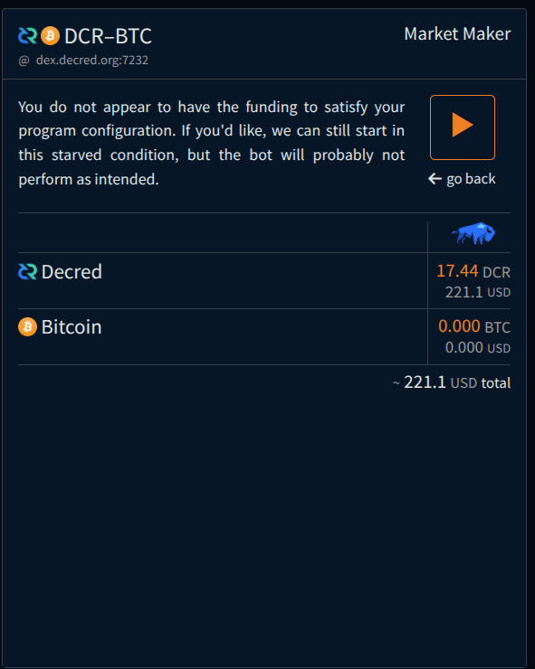
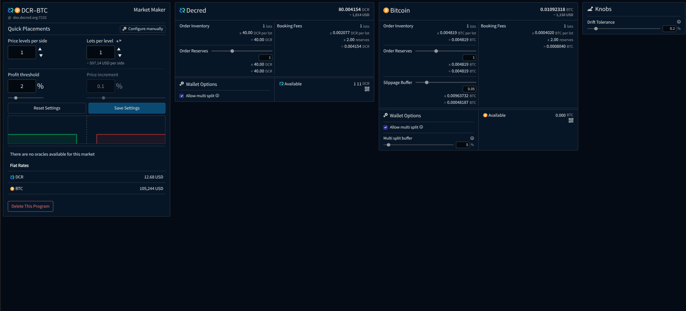

# Market Making

<a id="top"/>

_Last updated for Bison Wallet v1.0.0._

**Contents**

This page is part of the [Using Bison Wallet](Using-Bison-Wallet) guide, it assumes you have already 
set up a Bison Wallet using the [Getting Started Guide](Getting-Started).

---

Bison Wallet offers integrated market-making bots that allow users to strategically place orders on both sides of the order book 
and across supported centralized exchanges. This approach aims to capture potential profits through the spread and arbitrage opportunities, while also enhancing market stability. By providing liquidity and minimizing slippage, market makers help create 
a healthier and more stable trading environment.

> [!CAUTION]
> Using market-making functionality involves risk to your capital. Market conditions can change rapidly, potentially leading to 
losses from price fluctuations or market volatility. Ensure you understand these risks fully before participating in market making, 
as there is no guarantee of profit, and you may incur losses.

The market making functionality can be accessed from the header.

# Bot Management

Upon opening the market making screen, you can create a new bot, edit an existing bot, configure API access for centralized exchanges, or review previous run logs.

When creating a new bot, you will be prompted to select the market you want it to trade in. If you have configured API access for supported centralized exchanges, an icon will highlight the markets that support arbitrage strategies.

After selecting the desired market, a prompt will appear, allowing you to choose one of the supported bots.

After configuring placements and other parameters, the bot can be created by clicking the `Create Bot` button.

The Market Making Overview screen will appear, displaying all configured bots.

To start the bot, click the `Allocate and Run` button. A prompt will appear, confirming whether you have sufficient funds to run the bot with the configured parameters.

 
The bot can then be started by pressing the  button.

The market making screen will update to display the bot's status and key performance statistics. 

The bot can be stopped by pressing the `Stop` button, or deleted by pressing the  button. 

If you lack sufficient funds to run the bot with the specified parameters, the allocation prompt will display a warning.

You can still start the bot, but a warning will appear when orders cannot be placed.

Clicking the  button will open the orders report for the epoch, showing the available balances for the assets on the selected market and any deficits affecting the operation of the bot.

## Bot Settings

The market maker settings allow you to configure all the necessary parameters for your bot, it can be accessed by pressing the  button.

The bot's parameters can be confirmed by pressing the `Save Settings` button.

# Bot Types

The following section details the bot types available in Bison Wallet and their configuration parameters.

## Basic Market Maker

The Basic Market Maker aims to profit from market volatility by placing buy and sell orders at predefined price intervals based 
on the selected strategy. It works by creating a grid of orders around the basis market price. As the market fluctuates, 
buy orders are matched when the price drops to a specific level, and corresponding sell orders are matched as the price rises. 
The strategy continually adjusts by replenishing orders to maintain the grid, allowing traders to capture profits from price 
oscillations without needing to predict the market's direction.

### Basis Price

If oracles are available for a market, the basis price is calculated as the volume-weighted average of the prices returned by the oracles. The available oracles can be viewed on the market maker settings screen. If no oracles are available, the basis price is determined using the fiat rates of both assets, which are fetched from the sources specified on the [Settings Panel](Header#settings-panel).

### Placements

Placements refer to the settings and algorithm used by the market maker bot to strategically place buy and sell orders in the selected market. If the available balance is insufficient to place all orders, the bot will prioritize them accordingly.  

#### Quick Configuration

Bison Wallet's market-making feature offers a Quick Configuration mode, allowing users to easily set up market maker placements and adjust key parameters. This mode utilizes the `Percent Plus` gap strategy, where the gap between buy and sell orders starts at the breakeven spread — the minimum spread required for a buy-sell pair to be profitable when accounting for network fees — and adds a user-defined profit threshold, calculated as a percentage of the basis price. Additionally, Quick Configuration mode includes an interactive visual aid, enabling users to fine-tune their settings with ease.

The following placement settings are available in Quick Configuration mode:

* **Price Levels Per Side:** The number of steps or levels at which the bot will place orders on each side of the order book.
* **Lots per Level:** Quantity to be placed at each price level. As orders are matched, new orders will be placed to maintain this quantity.
* **Profit Threshold:** Adjusts the spread by adding a margin to the breakeven spread, expressed as a percentage of the mid-gap price.
* **Price Increment:** The price difference between consecutive order levels in the order book.

#### Manual Configuration

Manual placement configuration allows users to fine-tune their market-making strategy with greater precision while also providing access to various algorithms for order placement.

The following placement settings are available in the Manual Configuration mode:

* **Gap Strategy:** Defines the algorithm used to calculate the distance from the basis price when placing orders. Some algorithms factor in the break-even spread, which is the price difference between a buy and sell order where, if one lot of each is matched, the resulting profit precisely covers the network fees for both swaps. The following strategies are available:
    * **Percent Plus:** The distance from the basis price is calculated as the specified percentage of the price, plus half of the break-even spread.
    * **Percent:** The distance from the basis price is determined by the specified percentage of the price.
    * **Absolute Plus:** The distance from the basis price is exactly the specified rate in the placement, plus half of the break-even spread.
    * **Absolute:** The distance from the basis price is exactly the specified rate in the placement.
    * **Multiplier:** The distance from the basis price is a multiple of half the break-even spread.

* **Buy Placements:** Defines the bot's buy order placements.

* **Sell Placements:** Defines the bot's sell order placements.

### Asset Settings

The asset settings panel allows users to configure the amount of funds the bot will allocate and reserve while running in the specified market.

* **Order Inventory:** The amount of funds required to initially place all specified orders.
* **Order Reserves:** Additional funds allocated for placing extra orders, specified as a multiple of the initial placements.
* **Commit Total:** The total amount of funds allocated for order placements.
* **Booking Fees:**  The funds required to cover swap fee obligations for the initial placements.
* **Swap Fee Reserves:** Additional funds set aside for swap fees to accommodate extra orders, specified as the number of swaps.
* **Fee Reserves:** The total amount of funds allocated for swap fees..
* **Slippage Buffer:**  Extra funds reserved as a buffer to account for slippage..

### Knobs

The knobs panel contains additional settings that are specific to the basic market maker bot.

* **Drift Tolerance:** The allowable deviation from the ideal order price before the bot cancels and rebooks the order.

