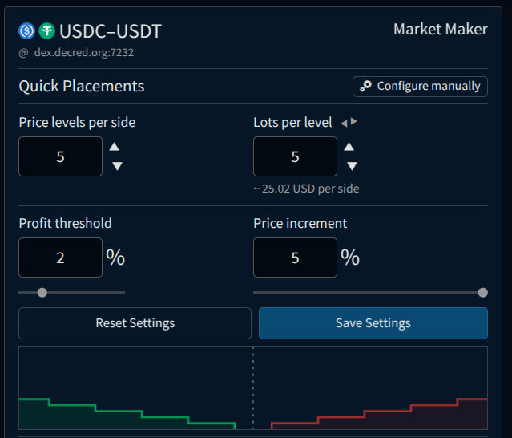

<a id="top"/>

_Last updated for Bison Wallet v1.0.0._

**Contents**

This page is part of the [Using Bison Wallet](Using-Bison-Wallet) guide, it assumes you have already 
set up a Bison Wallet using the [Getting Started Guide](Getting-Started).

---

Bison Wallet offers integrated market-making bots that allow users to strategically place orders on both sides of the order book 
and across supported centralized exchanges. This approach aims to capture potential profits through the spread and arbitrage opportunities, while also enhancing market stability. By providing liquidity and minimizing slippage, market makers help create 
a healthier and more stable trading environment.

> [!CAUTION]
> Using market-making functionality involves risk to your capital. Market conditions can change rapidly, potentially leading to 
losses from price fluctuations or market volatility. Ensure you understand these risks fully before participating in market making, 
as there is no guarantee of profit, and you may incur losses.

The market making functionality can be accessed from the header.

Upon opening the Market Making screen for the first time, you can create a new bot, configure API access for centralized exchanges, or review previous run logs.

# Creating a New Bot

When creating a new bot, you will be prompted to select the market you want to trade in. If you have configured API access for supported centralized exchanges, an icon will highlight the markets that support arbitrage strategies.

After selecting the desired market, a prompt will appear, allowing you to choose one of the supported strategies.

## Basic Market Maker

The Basic Market Maker aims to profit from market volatility by placing buy and sell orders at predefined price intervals based 
on the selected strategy. It works by creating a "grid" of orders around the basis market price. As the market fluctuates, 
buy orders are matched when the price drops to a specific level, and corresponding sell orders are matched as the price rises. 
The strategy continually adjusts by replenishing orders to maintain the grid, allowing traders to capture profits from price 
oscillations without needing to predict the market's direction.

The market maker settings allow you to configure all the necessary parameters for your bot.

### Basis Price

The basis price for the market maker is calculated using the mid-gap of the market order book as a starting point. If oracles are available and the oracle weighting is greater than 0, the oracle price is factored into the basis price adjustment.

In cases where the DEX market is empty:
- If oracles are available and their weighting is greater than 0, the oracle rate is used.
- If no oracles are available or their weighting is 0, the fiat rate is used.
- If no fiat rate is available, the configuration's empty market rate is applied.

### Placements

Placements refer to the settings and algorithm used by the market maker bot to strategically place buy and sell orders in the selected market. 

#### Quick Configuration

Bison Wallet's market-making feature offers a Quick Configuration mode, allowing users to easily set up market maker placements and adjust key parameters. This mode utilizes the `Percent Plus` gap strategy, where the gap between buy and sell orders starts at the breakeven spread—the minimum spread required for a buy-sell pair to be profitable—and adds a user-defined profit threshold, calculated as a percentage of the mid-gap price. Additionally, Quick Configuration mode includes an interactive visual aid, enabling users to fine-tune their settings with ease.

The following placement settings are available in Quick Configuration mode:

* **Price Levels Per Side:** The number of steps or levels at which the bot will place orders on each side of the order book.
* **Lots per Level:** The depth of each order, defined by the number of lots the bot allocates per price level.
* **Profit Threshold:** Adjusts the spread by adding a margin to the breakeven spread, expressed as a percentage of the mid-gap price.
* **Price Increment:** The price difference between consecutive order levels in the order book.

#### Manual Configuration

Manual placement configuration allows users to fine-tune their market-making strategy with greater precision while also providing access to various algorithms for order placement.

The following placement settings are available in the Manual Configuration mode:

* **Gap Strategy:** Sets the algorithm for calculating the distance from the basis price to place orders. The following strategies are available:
    * **Percent Plus:** The gap starts at the break-even spread, which is the minimum spread at which a buy-sell combo produces profit, 
    and then adds the specified spread, calculated as a percentage of the mid-gap price.
    * **Percent:** The gap is set to the specified percent of the mid-gap price.
    * **Absolute Plus:** The gap starts at the break-even spread, which is the minimum spread at which a buy-sell combo produces profit, 
    and then adds the specified rate difference to both sides.
    * **Absolute:** The spread is set to the specified value both left and right of the mid-gap, resulting in a total gap of twice the 
    specified value.
    * **Multiplier:** The gap is set to the specified multiple of the break-even spread, which is the minimum spread at which a buy-sell combo produces profit.

* **Buy Placements:** Defines the bot's buy order placements. If the available balance is insufficient to place all orders, the bot will prioritize them accordingly. 
* **Sell Placements:** Defines the bot's sell order placements. If the available balance is insufficient to place all orders, the bot will prioritize them accordingly.

### Asset Settings

The asset settings panel allows users to configure the amount of funds the bot will allocate and reserve while running in the specified market.

