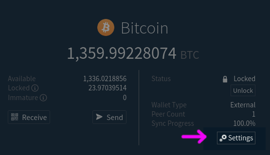
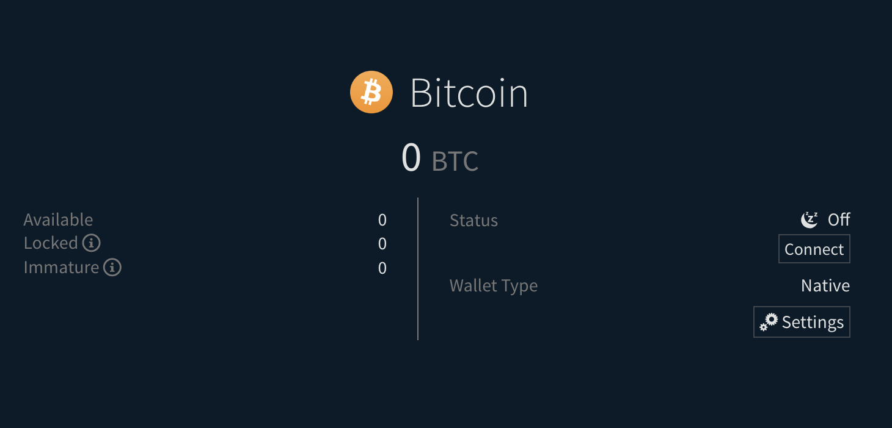
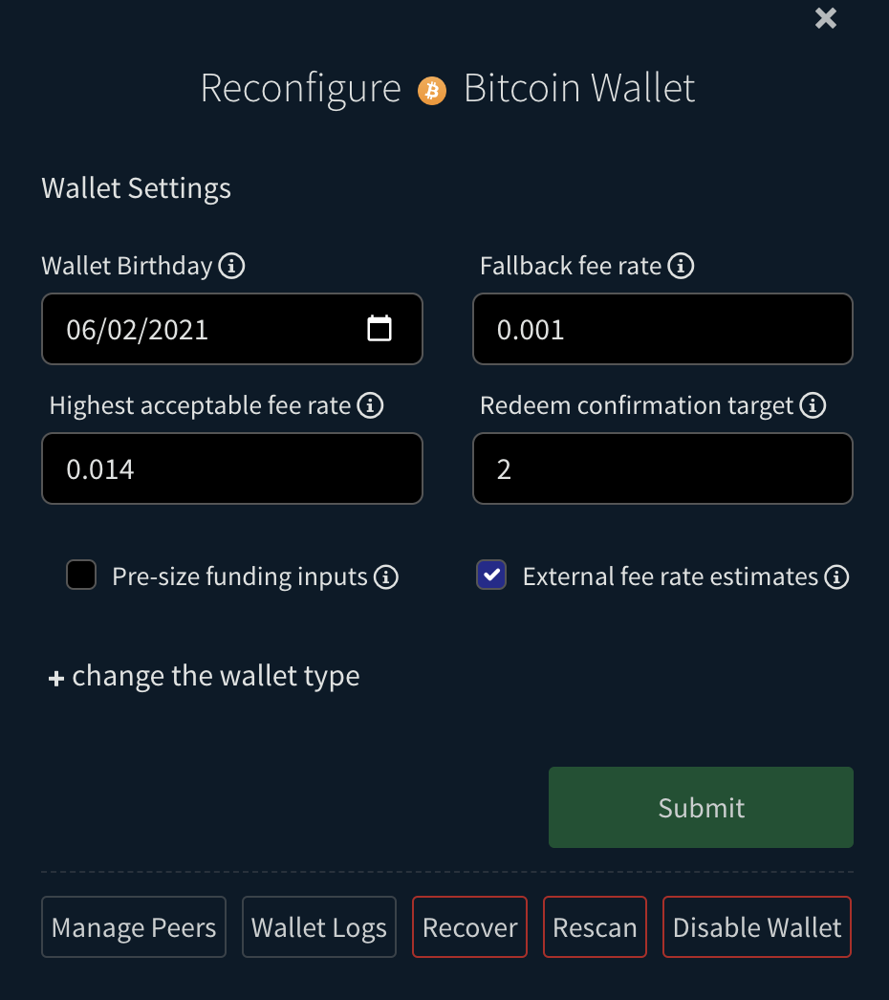

# BTC Wallet Recovery and Rescanning

## Opening the BTC Wallet Settings

In this guide, we will be using the Native BTC wallet that is built into DEX and you should learn how to navigate to the settings view.  The settings view is where you can reinitialize the wallet, rescan the wallet, etc.

1. Navigate to the `Wallets` page (`/wallets`) and select the Bitcoin wallet if it is not already selected.
2. Click the `Settings` button that has a gears icon to open the settings dialog.

   

## Reinitializing the Native BTC Wallet

If the native BTC wallet is corrupted, the `dexc.log` (located at `~/.dexc/mainnet/logs` for Linux, `~/Library/Application\ Support/Dexc/mainnet/logs`, for MacOS and `C:\Users\<Username>\AppData\Dexc\mainnet` for windows) may have a message containing "wallet not found", such as:

> [ERR] CORE: Unable to connect to **btc** wallet (start and sync wallets BEFORE starting dex!): **connectWallet: failed to connect btc wallet: connect failure: wallet not found**

Note **btc** in the above message, and **wallet not found**.  This may also say something about db corruption, or similar errors, which may also be addressed as follows.

In this case, the Wallets page (`/wallets`) will still show the wallet since it was previously configured, just that it is not synchronized and cannot be unlocked or connected.  It will look like this:

To reinitialize the wallet, [open the wallet settings dialog](#opening-the-btc-wallet-settings) and click the `Recover` button:

The `dexc.log` should say:

> \[DBG\] CORE\[btc\]\[SPV\]: Starting native BTC wallet...

The wallet will begin re-synchronizing.  This may take several minutes.

**IF** this process results in errors, it may be necessary to go to the folder containing the wallet data and **delete the wallet.db so it may be regenerated** from your application seed.  To do this:

1. Shutdown DEX.
2. Open the wallet directory. For mainnet, this would be:
    - `~/.dexc/mainnet/assetdb/btc/mainnet/` on Linux
    - `~/Library/Application\ Support/Dexc/mainnet/assetdb/btc/mainnet/` on MacOS
    - `C:\Users\<Username>\AppData\Dexc\mainnet\assetdb\btc\mainnet` on Windows.
    There may be a wallet.db file in this folder, which you should rename wallet.db.bak.
3. Startup and login to DEX.
4. \[Open the BTC wallet settings\](#opening-the-btc-wallet-settings) and click `Recover` again.

If you still encounter any error in the logs or notification, you can reach out to us on our chat channels. We will be happy to help you out.

## Rescanning the wallet

In rare circumstances, the wallet may need to rescan the blockchain for missed transactions.  This is a process that can take several hours, depending on the number of transactions in the wallet.

To rescan the wallet, [open the wallet settings dialog](#opening-the-btc-wallet-settings) and click the `Rescan` button.  You will a message with a green check icon if the rescan was successful.

**IF** you wish to force a rescan, you can do so by following these steps:

1. Delete the wallet.db file in the `assetdb/btc/mainnet/` (for mainnet) folder as described at the end of the previous section.  Start DEX and log in. Follow the instructions in [the Reinitializing the Native BTC Wallet section](#reinitializing-the-native-btc-wallet) to reinitialize the wallet and begin a resync.
2. OR (**safest option**) use the `dropwtxmgr` tool on that wallet.db file.  See the instructions in <https://github.com/btcsuite/btcwallet/blob/master/docs/force_rescans.md>.  You will build that tool as described there and then run it on DEX's btc wallet.db. For example `dropwtxmgr --db ~/.dexc/mainnet/assetdb/btc/mainnet/wallet.db`.  When you start DEX and login again, it will begin to rescan the wallet.

## Full reinitialize

In addition to reinitializing or rescanning the BTC wallet.db file, you may also remove all of the chain data files to force resynchronization of all blockchain data used by the neutrino service that powers the wallet.  To do this, shutdown DEX and delete all of the files in `assetdb/btc/mainnet/` (for mainnet), including `neutrino.db`, `reg_filter_headers.bin`, `block_headers.bin`, and `wallet.db`.  You may keep `peers.json` to help with bootstrapping when you restart, but it may be deleted too.

Next, startup DEX and go to the Wallet page. [open the wallet settings dialog](#opening-the-btc-wallet-settings) and click `Recover` after ensuring it is currently showing the `Native` wallet option as in the [first section's screenshot](#reinitializing-the-native-btc-wallet).
