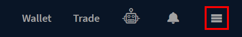

<a id="top"/>

_Last updated for Bison Wallet v1.0.0._

**Contents**

- [Order Types](#order-types)
- [Placing an Order](#placing-an-order)
  - [Fee Details](#fee-details)
  - [Lot Size](#lot-size)
- [Trade Execution](#trade-execution)
  - [Funding](#funding)
  - [Epoch](#epoch)
  - [Matching](#matching)
  - [Settlement](#settlement)
  - [Revoked Matches](#revoked-matches)
- [Order History](#order-history)
- [Order Details](#order-details)

This page is part of the [Using Bison Wallet](Using-Bison-Wallet) guide, it assumes you have already 
set up a Bison Wallet using the [Getting Started Guide](Getting-Started).

# Order Types

Bison Wallet supports the following types of orders:

* **Market Order:** A market order is an instruction to buy or sell an asset immediately at 
the current best available price. The user specifies only the quantity, not the rate.

* **Limit Order:** A limit order is an instruction to trade an asset at a specified price or better 
— no higher for buy orders, and no lower for sell orders. The user must specify the order quantity 
as an integer multiple of the asset’s [lot size](#lot-size). The order may also be set as "immediate or cancel", 
which restricts it to being a taker order by only allowing a match when it is initially processed.

* **Cancel Order:** A cancel order is used to remove an existing limit order from the order book. 
Cancel orders can only be initiated by pressing the 
 button in the 
[Your Orders](Trade#your-orders) section or the [Order Details](#order-details).

# Placing an Order

Once the necessary fields in the [Submit Order](Trade#Submit-Order) form have been populated, 
your order can be submitted by clicking the ``Place Order`` button.

A prompt will appear to verify the details of the submitted order. 
Fee projections will be displayed. Clicking the `details` button will 
open the [Fee Details](#fee-details) view.

The redemption transaction fees can be manually increased to speed up the 
confirmations on redemption by clicking the `show advanced options` button.

The [Trade Execution](#trade-execution) section describes the sequence your order 
follows once it has been submitted to the DCRDEX server. 

## Fee Details

DCRDEX does not collect any fees on the trades, but since all swap transactions
occur on-chain and are created directly by the users, they will pay network
transaction fees. Transaction fees vary based on how orders are matched and
network activity. Fee estimates are shown during order submission, and the realized 
fees are displayed on the [order details](#order-details) view once the trade settles.

The fee details screen indicates the best and worst-case settlement fee estimates
based on network conditions at the time of order submission. If network congestion
is higher when the order is matched, the fees could be higher but will remain
less or equal to the `Maximum Possible Swap Fees`.

## Lot Size

The Lot Size for a market specifies both the minimum order quantity and the order quantity increment 
for limit and market orders, measured in the market's base asset. 

Lot sizes are a server-side configurable parameter set individually for each market and are typically 
set by server operators to ensure on-chain transaction fees do not eat a significant portion of the
order quantity. To illustrate, if on-chain transaction fees worked out to $5, and a user was able
to place an order to trade $10, they would lose half of their trade to transaction fees. 
For chains with single-match fees of $5, if the operator wanted to limit possible fees to under 
1% of the trade, the minimum lot size would need to be set to about $500.

The scenario with the lowest fees is for an entire order to be consumed by a single match. 
If this happens, the user pays the fees for two transactions: one on the chain of the asset the user 
is selling and one on the chain of the asset the user is buying. The worst case is for the order to be 
filled in multiple matches each of one lot in amount, potentially requiring as many swaps as lots
in the order.

# Trade Execution

The section below outlines the sequence your order follows once submitted to the DCRDEX server. 
This process occurs automatically in the background within Bison Wallet, requiring no action from you.

## Funding

Since orders must be funded by coins from the user’s wallets, placing an order “locks” a corresponding 
amount in the relevant wallet. For example, a buy order in the DCR-BTC market locks a certain quantity 
of BTC in the user’s wallet, though no actual transactions or fund movements occur. This locked amount 
will be shown in the “locked” row of the Balances table.

It’s important to note that the locked amount may be larger than the order quantity. For UTXO-based assets 
like Bitcoin and Decred, this is because the “locked” amount depends on the size of the UTXO reserved as input 
for the swap transaction. Any unused portion of this UTXO is returned to a change address after the swap, similar 
to a regular transaction. However, since the UTXOs are locked in advance of broadcasting the actual transaction, 
the locked amount will appear in the wallet until the swap occurs.

For some assets, there may be a wallet setting on the Wallet page to pre-size UTXOs and prevent this over-locking. 
However, this requires an additional transaction that incurs on-chain fees, which may be costly on networks 
like Bitcoin, and it only applies to limit orders that are not set to "Immediate or Cancel". Taker-only orders, 
which are not booked, are only briefly locked until the swap transaction is broadcast.

## Epoch

An important concept in DCRDEX is that newly submitted orders are processed in short time intervals called 
epochs, typically around 10 seconds, though the exact duration is configured server-side for each market.
When a valid order is received by the server, it enters an epoch order pool, where it awaits matching or 
booking. This approach is further detailed in the DCRDEX specification. In the [Your Orders](Trade#your-orders) 
section, the status of such orders appears as "epoch" until they are either booked or matched at 
the end of the epoch.

Order cancellation requests are processed alongside trade (market/limit) orders within the same epoch since 
a cancellation request is also treated as an order. However, from the user's perspective, canceling an order 
is as simple as clicking the cancel icon next to their booked order.

## Matching

When the end of an epoch is reached, the orders it includes are then matched with the orders that are already 
on the book. A key concept of DCRDEX order matching is a deterministic algorithm for shuffling the epoch orders 
so that it is difficult for a user to game the system. To perform the shuffling of the closed epoch prior to 
matching, clients with orders in the epoch must provide to the server a special value for each of their orders 
called a **preimage**, which must correspond to another value that was provided when the order was initially
submitted called the **commitment**. This is done automatically by Bison Wallet, requiring no action from the user.

If an order fails to match with another order, it will become either **booked** or **executed** with no 
part of the order filled. The [Your Orders](Trade#your-orders) section displays the current status and remaining 
quantity of each of a user's orders. If an order does match with another trade order, the order status will become
**settling**, and atomic swap negotiation begins. A cancel order may also fail to match if another trade 
matches with the targeted order first, or it may match after the targeted order is partially filled in the same epoch.

## Settlement

When maker orders (on the book) are matched with taker orders (from an epoch), the atomic swap sequence begins.
No action is required from either user during the process.

In the current atomic swap protocol, the **maker initiates** by broadcasting a transaction with a swap contract 
on the relevant asset network, and informing the server of the transaction and the full contract. 
The server audits the contract, and if it is successfully validated, the information is relayed to the
taker, who independently audits the contract to ensure it meets their expectations. 
The transaction containing the maker's swap contract must then be mined and reach the
**swap confirmation requirement**, which is also a market setting. For example, Bitcoin might 
require 3 confirmations while other chains like Litecoin might be considerably more. 

When the required number of confirmations is reached, the **taker participates** by broadcasting a transaction 
with their swap contract and informing the server. Again, the server and the counterparty audit the contract 
and wait for that asset's swap confirmation requirement. When the required confirmations are reached, 
the **maker redeems** the taker's contract  and informs the server of the redemption transaction.
This is the end of the process for the maker, as the redemption spends the taker's contract, paying to an 
address controlled by the maker. The server relays the maker's redeem data to the taker, and the 
**taker redeems** immediately, ending the swap.

Read more about atomic swaps in the [Decred Documentation](https://docs.decred.org/advanced/atomic-swap/).

## Revoked Matches

While the atomic swap process requires no party to trust the other, a swap may be forced into an alternate path 
ending in one or both users refunding themselves by spending their own contract after the lock time expires. 
This happens when one of the parties fails to act in the expected time frame, an inaction timeout. 
When an inaction timeout occurs the following happens:

* The match is revoked, and both parties are notified.
* The at-fault user has their order revoked (if it was partially filled and still booked) and is notified.
* The at-fault user has their score adjusted according to type of match failure. See below for descriptions 
of each type and the associated user score adjustments.

The general categories of match failures are:

* **NoMakerSwap:** A match is made, but the maker does not initiate the swap. No transactions are created in this case.
* **NoTakerSwap:** The maker (initiator) broadcasts their swap contract transaction and informs the server, 
but the taker (participant) fails to broadcast their swap contract and inform the server. 
The maker will automatically refund their contract when it expires after 20 hrs.
* **NoMakerRedeem**: The taker broadcasts their swap and informs the server, but the maker does not redeem it. 
The taker will refund when their contract expires after 8 hrs. Note that the taker's client begins watching for 
an unannounced redeem of their contract by the maker, which reveals the secret and permits the taker to redeem 
as well, completing the swap although in a potentially extended time frame.
* **NoTakerRedeem:** The maker redeems the taker's contract and informs the server, but the taker fails to redeem
the maker's contract even though they can do so at any time. This case is not disruptive to the counterparty, and 
is only detrimental to the takers, so it is of minimal concern.

>[!NOTE]
> The order remaining/filled amounts are reduced at match time, even if a portion of the order was 
matched but not settled.

# Order History

The Order History can be accessed by clicking the hamburger menu in the [header](Header).

The Order History view displays summary information for each of your previously submitted orders
across any connected DCRDEX servers. Filtering options are available on the left side
of the screen. The [Order Details](#order-details) view can be opened by clicking
the 
button on any order. 

The Order History view provides access to the functionality to export all of your trade information 
in CSV format and delete your archived trade data via the **Other Actions** section in the bottom
left of the screen.

---

# Order Details

The order details view displays all the information pertaining to a specific order.

* **Exchange:** DCRDEX server where the order was submitted.
* **Market:** the market where the order was submitted.
* **Type:** [type of order](#order-types) submitted.
* **Status:** Indicates the current status of the order, the [Trade Execution](#trade-execution) 
 section provides further information on what occurs, as an order is booked, matched and settled.
  * **Epoch:** order has been received and validated by the DCRDEX server but not processed yet
  by the epoch order matcher.
  * **Booked:** order has been placed in the book, including partially filled orders.
  * **Executed:** orders that have been successfully matched and removed from the book.
  Including the following scenarios:
    * Completely filled limit or market order.
    * Partially filled market buy order.
    * Cancelled by the client, in the case of *Cancel Orders*.
  * **Cancelled:** orders that were on the book but were cancelled by the client.
  * **Revoked:** Order revoked due to infringement of server policy. This includes
  limit orders that were matched but failed to swap.
* **Offering:** Amount the of funds the user is exchanging.
* **Asking:** Amount the of funds the user is expecting in return.
* **Rate:** Effective exchange rate.
* **Filled:** Percentage of the order has been [matched](#matching).
* **Settled:** Percentage of the order has been [settled](#settlement).
* **Fees:** The realized fees of the trade.
* **Age:** Time when the order was initially submitted.

Each match associated with the order is listed under the **Matches** section, with links to
the relevant blockchain explorers for each associated transaction.

* **Match ID:** unique identifier for each match.
* **Status:** current status of a match, the [settlement](#settlement) section
details the process an order goes through once it's been matched:
  * Newly Matched.
  * Maker Swap Sent.
  * Taker Swap Sent.
  * Redemption Sent.
  * Revoked.
  * Refund Pending.
  * Refunded.
  * Redeem Pending.
  * Redemption Confirmed.
* **Time:** the match time. 
* **Rate:** exchange rate for the match.
* **Side:** Maker or Taker.
* **Order Portion:** Percentage of the order that is covered by this match.
* **Maker Swap:** Swap transaction broadcast by the maker.
* **Taker Swap:** Swap transaction broadcast by the taker.
* **Maker Redemption:** Redemption transaction broadcast by the maker.
* **Taker Redemption::** Redemption transaction broadcast by the taker.
* **Funding Coins:** The UTXO or address with the funding for this match.

---

Next Section: [Managing your DCRDEX Accounts](Managing-your-DCRDEX-Accounts)

[⤴  Back to Top](#top)