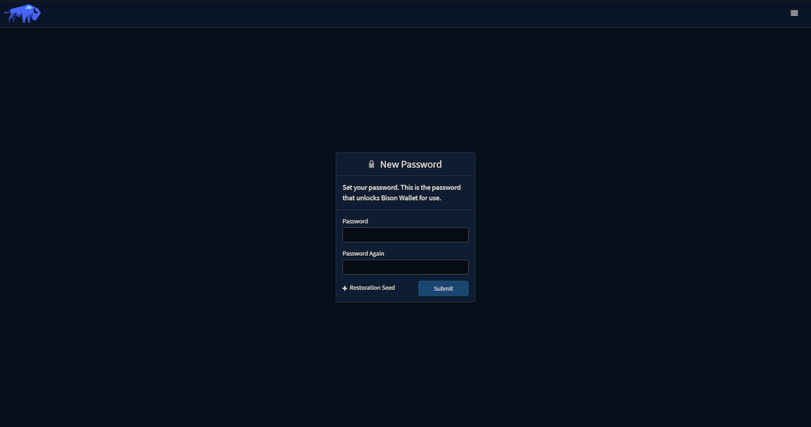
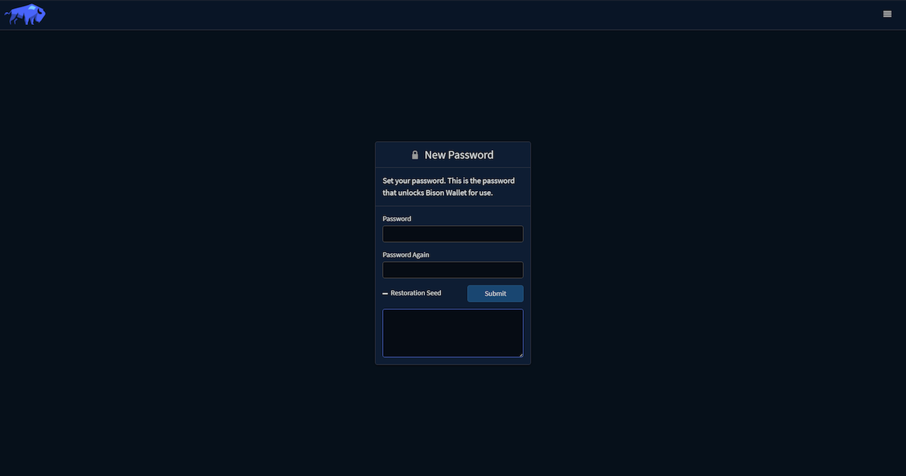
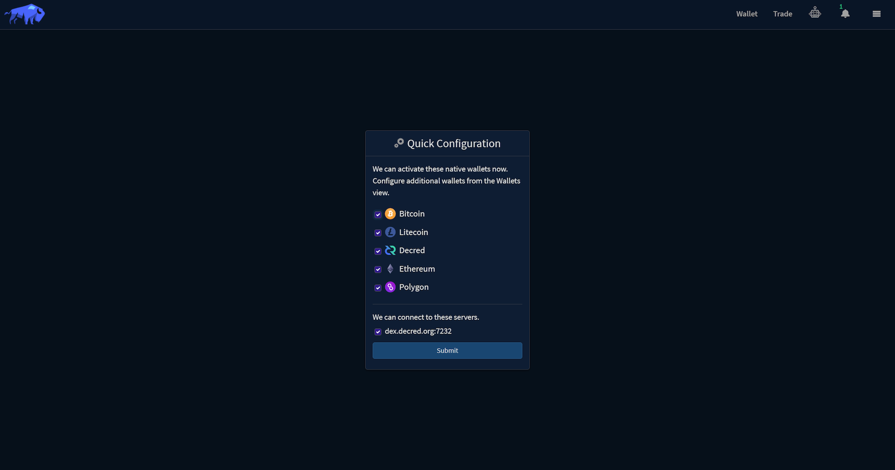
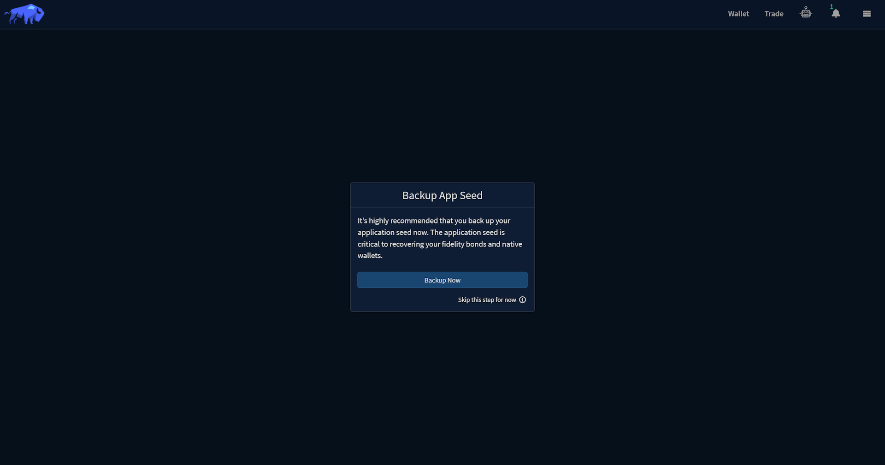
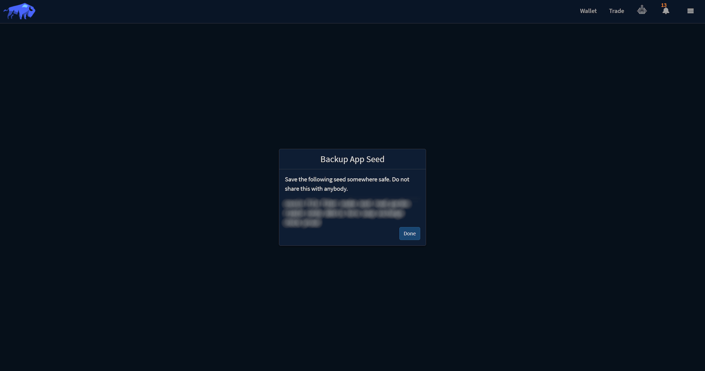
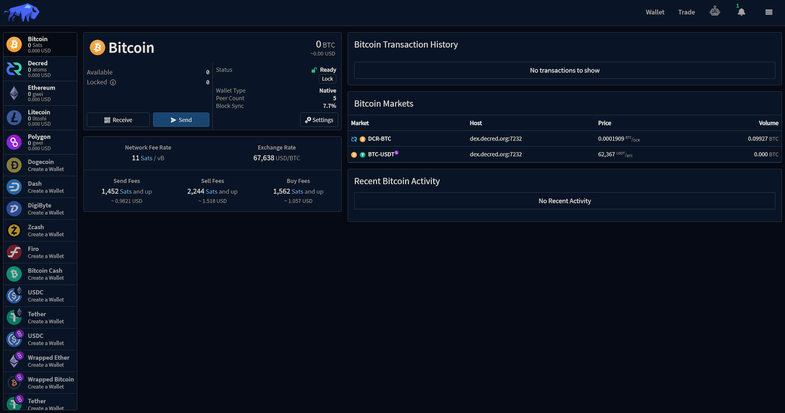

_Last updated for Bison Wallet v1.0.0._

**Contents**

- [New Password](#new-password)
- [Restore Existing Seed](#restore-existing-seed)
- [Quick Configuration](#quick-configuration)
- [Backup Application Seed](#backup-application-seed)
- [Wallet Synchronization](#wallet-synchronization)

This guide assumes you have already [downloaded and installed](Download-and-Install) Bison Wallet.

# New Password

Opening Bison Wallet for the first time will display the following prompt:

Setting your new client application password and clicking `Submit` will generate a new wallet.
You will use this password to perform all future security-sensitive client operations.

# Restore Existing Seed

From the `New Password` prompt, you can also restore an existing application seed by clicking
in the `Restoration Seed` button and entering the seed backup phrase in the 15 word format.

If you have previously exported DCRDEX accounts that you wish to restore, refer to the
[Import DCRDEX Accounts](Managing-your-DCRDEX-Accounts#import-dcrdex-account) section of this wiki.

# Quick Configuration

The Quick Configuration wizard lets you select which [native wallets](Wallet#native-wallet)
to create, you can always create them later in the [Wallet](Wallet#creating-a-new-wallet) tab.

The selected native wallets will be created and Bison Wallet will connect to the selected
DCRDEX server when you submit the form.

> [!NOTE]
> If you encounter an error about not being able to connect to the selected DCRDEX
server during the quick configuration, you can always manually add a DCRDEX server later through the settings
panel

# Backup Application Seed

Once the selected [native wallets](Wallet#native-wallet) have been created as part
of the Quick Configuration wizard, a prompt will appear to backup your application seed. This seed is
used to restore your DCRDEX accounts and any native wallets - so keep it safe.

Clicking `Backup Now` will reveal the seed in a 15-word format, you can also skip this step.

> [!NOTE]
> If you skip this step now (not recommended), you can go to the Settings panel to
retrieve your application seed later.

Click `Done` once you have backed up your seed.

> [!CAUTION]
>This seed phrase is essentially the private key for your native wallets.
You will be able to use this seed phrase to restore your private keys, transaction history,
and balances using Bison Wallet on any computer. This ultimately means that anyone who knows your
seed can use it to restore your private keys, transaction history, and balances to Bison Wallet
on their computer without your knowledge. For this reason, it is of utmost importance to keep your
seed phrase safe. Treat this seed the same way you would treat a physical key to a safe.
>
>If you lose your seed phrase, you permanently lose access to your wallet and all funds within it.
It cannot be recovered by anyone, including the Bison Wallet developers. It is recommended you write
it down on paper and store that somewhere secure.  If you decide to keep it on your computer,
it would be best to keep it in an encrypted document (do not forget the password) in case the file
or your computer is stolen.
>
> _**DO NOT, UNDER ANY CIRCUMSTANCES, GIVE YOUR SEED TO ANYONE!
NOT EVEN BISON WALLET OR DECRED DEVELOPERS!**_

# Wallet Synchronization

After the [Quick Configuration](Quick-Configuration) wizard has been completed, the
[Wallet](Wallet) view will be displayed, the Block Sync indicator
 on each wallet shows the progress as each blockchain is synchronized.

---

Next Section: [Creating a DCRDEX Server Account](Creating-a-DCRDEX-Server-Account)

[⤴  Back to Top](#top)
