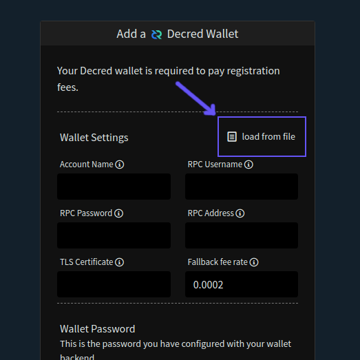

# Testnet Testing

- [Prepare Wallets](#prepare-wallets)
  - [Run Bitcoin Daemon](#run-bitcoin-daemon)
  - [Create the Bitcoin Testnet Wallet](#create-the-bitcoin-testnet-wallet)
  - [Create a Bitcoin Exchange Wallet Configuration File](#create-a-bitcoin-exchange-wallet-configuration-file)
  - [Run Decred Daemon and Wallet Software](#run-decred-daemon-and-wallet-software)
  - [Create a Decred Exchange Wallet Configuration File](#create-a-decred-exchange-wallet-configuration-file)
- [Get the Testnet Server TLS Certificate](#get-the-testnet-server-tls-certificate)
- [Start the Client](#start-the-client)
- [Register the Client](#register-the-client)
- [Acquire Testnet Funds](#acquire-testnet-funds)

## Prepare Wallets

### Run Bitcoin Daemon

The initial release of DEX requires a full Bitcoin node. Bitcoin Core
(`bitcoind` or `bitcoin-qt`) is recommended. Pruning is okay for testnet testing, because you
won't be running the server, but **if you ever plan to test the server**, you
will need to run without pruning and with the transaction index built,
`-txindex`.

Be sure to set the `rpcuser` and `rpcpassword` in your `bitcoind` configuration
file (recommended, shown), or as a command line argument (adjust commands below
as needed). You can set `rpcuser` and `rpcpassword` to any value you'd like.

```sh
> bitcoind -testnet -server -debug=rpc
```

#### Create the Bitcoin Testnet Wallet

To create a dedicated "dex" wallet, run

```sh
> bitcoin-cli -testnet createwallet dex
```

Encrypt the wallet with a password of your choosing.

```sh
> bitcoin-cli -testnet -rpcwallet=dex encryptwallet mypassword
```

Note: Normally prefixing the above command with a space will keep it out of your command line history.

Bitcoin Core will not load the wallet on startup, so I recommend you create
a testnet section in your configuration file instructing the wallet to be
loaded.

Add to **bitcoin.conf**

```ini
[test]

wallet=
wallet=dex
```

If you do not amend **bitcoin.conf**, you will need to `bitcoin-cli -testnet loadwallet dex`
every time you start `bitcoind`.

#### Create a Bitcoin Exchange Wallet Configuration File

Create a DEX wallet configuration file with your credentials.

Add to **btc_testnet.conf**

```ini
walletname=dex
rpcuser=abc
rpcpassword=def
rpcport=18332
```

Port `18332` is the default testnet port. If you've specified a different port
in your configuration file, you'll need to specify that port instead.

### Run Decred Daemon and Wallet Software

Get the dcrd/dcrwallet/dcrctl command line suite from [the latest release binaries](https://github.com/decred/decred-release/releases/tag/v1.5.1) or building from master ([`dcrd`](https://github.com/decred/dcrd#build-from-source-all-platforms), [`dcrwallet`](https://github.com/decred/dcrwallet#build-from-source-all-platforms), [`dcrctl`](https://github.com/decred/dcrctl#build-and-installation) or alternatively [this dcrbuild.sh script](https://gist.github.com/chappjc/6cfc52a5b700a43c03d533172f91aa57) on Linux/Mac), which fairly simple.

Sync the Decred blockchain. Set the `username` and `password` in the `dcrd`
configuration file (recommended, shown), or as a command line argument (adjust
commands below as needed). You can set `username` and `password` to any value
you'd like.

```sh
> dcrd --testnet
```

Once Decred is synchronized, start `dcrwallet`.

```sh
> dcrwallet --testnet
```

If this is your first time running **dcrwallet** on testnet, you'll be prompted
to run with `--create` to set your password and create the wallet. You'll need
the wallet password later.

At this point, you may choose to specify a new account just for trading. For
the remainder of these instructions, is it assumed this step is complete.

```sh
> dcrctl --testnet --wallet createnewaccount dex
```

#### Create a Decred Exchange Wallet Configuration File

Create a DEX wallet configuration file with your credentials.

Add to **dcr_testnet.conf**

```ini
account=dex
username=abc
password=def
rpccert=/path/to/.dcrwallet/rpc.cert
rpclisten=127.0.0.1:19110
```

The `rpclisten` shown is the default for testnet. If you have specified a
different port in your **dcrwallet** configuration, you'll need to use that.
Make sure to enter the correct path for your TLS certificate (`rpccert`). If not
specified, the certificate is typically located at `~/.dcrwallet/rpc.cert`.

## Get the Testnet Server TLS Certificate

There is a Decred testnet server at dex-test.ssgen.io:7232. As part of
the registration process, you'll need to supply the TLS certificate to the client.
The certificate can be found [here](files/dex-test.ssgen.io.cert).

## Start the Client

Clear any existing client DB files from previous setups:

```sh
rm ~/.dexc/testnet/dexc.db ~/.dexc/testnet/backup/dexc.db
```

Start `dexc` with the web UI and RPC server in testnet mode and trace level logging:

```sh
./dexc --testnet --rpc --log=trace
```

### Register the Client

In a browser, navigate to <http://127.0.0.1:5758/>, and be sure JavaScript is
enabled. This should redirect to <http://127.0.0.1:5758/register>.

1. Setup the app pass.
2. Configure the DCR exchange wallet by loading the settings from the *dcr_testnet.conf* file created above.

   

3. Specify the DEX server and upload the TLS certificate.

   

4. Pay fee (type in app pass to authorize payment from DCR wallet).
5. Wait for the notification indicating that registration is complete. This requires confirmations of your fee payment, and may take some time.
6. Set up your BTC wallet from the markets view or the wallets view. You will load settings from the **btc_testnet.conf** file.
7. Once you have both wallets created, and your registration fee is confirmed, gather some funds and start trading.

### Acquire Testnet Funds

#### DCR

Get an address for your Decred testnet account using **dcrctl**.

`dcrctl --testnet --wallet getnewaddress dex`

Take that address to the testnet faucet at <https://faucet.decred.org/> and get
some DCR.

#### BTC

You can generate a deposit address for BTC through the wallets view in the
client app.

Testnet BTC is hard to come by. If you can't get your hands on any, place an
order on testnet DEX to sell some DCR for BTC.
