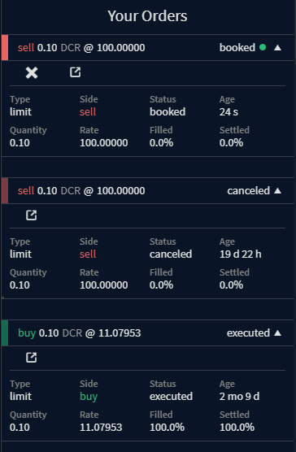

<a id="top"/>

_Last updated for Bison Wallet v1.0.0._

## Contents

- [Markets](#markets)
- [Order Book](#order-book)
- [Candle \& Depth Charts](#candle--depth-charts)
- [Order Panel](#order-panel)
  - [Submit Order](#submit-order)
  - [Trading Tier](#trading-tier)
  - [Reputation](#reputation)
  - [Your Orders](#your-orders)
  - [Recent Matches](#recent-matches)

This page is part of the [Using Bison Wallet](Using-Bison-Wallet) guide, it assumes you have already
set up a Bison Wallet using the [Getting Started Guide](Getting-Started).

# Markets

The markets available on the connected DEX servers are listed on the left side of the screen, along with
last price, and 24-hour percentage changes.

# Order Book

The order book panel displays active buy and sell orders for the selected market, showing rate and
quantities ordered by level. It’s split into ``Bids`` (buy orders) and ``Asks`` (sell orders).

# Candle & Depth Charts

The Candle Chart displays the price history for the selected market over time, while the depth chart is
a visual representation of the order book, showing cumulative buy and sell orders at various price levels.

# Order Panel

The order panel allows you to place orders, manage orders, view recent matches for the selected market, and access your trading tier and reputation with the associated DEX server.

## Submit Order

The Submit Order section is located at the top of the order panel.

Read more about order types, how to place an order and trade settlement process
in the [Order Management](Order-Management) section of this wiki.

## Trading Tier

The trading tier for the associated DCRDEX server account on the selected market can be viewed by
clicking the `Show Trading Tier Info` button.

- **Parcel Size:** A server-side configurable parameter on DCRDEX, set individually for each market.
It defines the number of [lots](Order-Management#lot-size) a user can trade based on their trading tier.
In markets with low-fee assets, lot sizes may be very small, resulting in a larger parcel size.
Conversely, markets with high-fee assets generally have larger lot sizes, where a smaller parcel
size may be more appropriate.
- **Trading Tier:** Reflects your account's current actual trading tier with the DCRDEX server,
determined based on your active [bonds](Creating-a-DCRDEX-Server-Account#fidelity-bonds)
and [reputation score](Managing-your-DCRDEX-Accounts#reputation-score).
When your trading tier falls below 1, your booked orders will be revoked.
- **Trading Limits:** The maximum number of lots you can trade in the selected market,
calculated based on the market’s parcel size and your actual trading tier.
- **Current Usage:** Shows the proportion of trading limits used. The DCRDEX server tracks usage
across all markets, assessing trading limits globally for each account.

## Reputation

The reputation score for the associated DCRDEX server account on the selected market
can be viewed by clicking the **Show Reputation** button.

Read more about reputation in the [managing your DCRDEX accounts](Managing-your-DCRDEX-Accounts)
section of this wiki.

## Your Orders

This section show your recent orders for the selected market.

Clicking each order will expand it to display additional information.
If an order is still in booked status, it can be cancelled by the
 button,
while the [Order Details](Order-Management#order-details) view can be accessed by clicking
the  button. Stuck swap transactions can also be accelerated by clicking the
 button.

- **Type:** The type of order. "limit", "market", or "cancel".
- **Side**: buy or sell.
- **Status:** The status of the order: epoch, booked, executed, canceled, or revoked.
Read more about status in the [Order Details View](Order-Management#order-details) section of this wiki.
- **Age:** The time that this order has been active in human readable form.
- **Quantity:** The amount being traded.
- **Filled:** The order quantity that has been matched.
- **Settled:** The sum quantity of all completed matches.

## Recent Matches

This section displays a feed of recent matched orders for the selected market,
indicating the rate and quantity of each match.

---

Next Section: [Order Management](Order-Management)

[⤴  Back to Top](#top)
