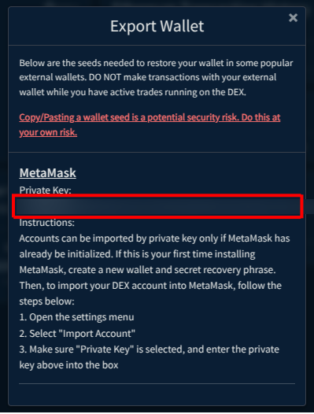

<a id="top"/>

_Last updated for Bison Wallet v1.0.0._

> [!CAUTION]
> Before starting any attempt at fixing a broken wallet, ensure you have your correct
15 word seed written down (preferably physically, on a piece of paper) and accessible,
along with an
> [export of your DCRDEX server accounts](Managing-your-DCRDEX-Accounts#export-dcrdex-account).
>
> If you have lost your seed, you are in serious danger of losing access to your funds
permanently - we recommend backing it up via the [Settings Panel](Header#settings-panel).

## Contents

- [Location of Application and Log files](#location-of-application-and-log-files)
- [Native Wallets](#native-wallets)
  - [Rescanning](#rescanning)
  - [Recovery](#recovery)
  - [Forced Rescan](#forced-rescan)
  - [Full Reinitialize](#full-reinitialize)
  - [Private Key Export](#native-wallet-export)

# Location of Application and Log files

The main location for Bison Wallet data files is OS-dependent:

| OS      | Bison Wallet Path                        |
|---------|------------------------------------------|
| Windows | ``%LocalAppData%/Dexc/``                 |
| Linux   | ``~/.dexc/``                             |
| macOS   | ``~/Library/Application\ Support/Dexc/`` |

There are different log files which may be reviewed when troubleshooting a problem:

| Log               | Location                                             |
|-------------------|------------------------------------------------------|
| Main application  | ``mainnet/logs/dexc.log``                            |
| Native DCR wallet | ``mainnet/assetdb/dcr/mainnet/spvlogs/neutrino.log`` |
| Native BTC wallet | ``mainnet/assetdb/btc/mainnet/logs/neutrino.log``    |
| Native LTC wallet | ``mainnet/assetdb/ltc/mainnet/logs/neutrino.log``    |

# Native Wallets

## Rescanning

>[!NOTE]
> This section of the is only applicable to Decred, Bitcoin and Litecoin wallets.

In rare circumstances, your wallet may need to rescan the blockchain for missed transactions.
This is a process that can take several hours, depending on the number of transactions in the wallet.
To rescan the wallet, open the [wallet settings](Wallet#wallet-settings) dialog and click the `Rescan` button.

You will see a message with a green check icon if the rescan was successfully initiated.

## Recovery

>[!NOTE]
> This section of the is only applicable to Decred, Bitcoin and Litecoin wallets.

If a neutrino wallet is corrupted, the [dexc.log](#location-of-application-and-log-files) may have a message
similiar to:

``
[ERR] CORE: Unable to connect to btc wallet (start and sync wallets BEFORE starting dex!):
connectWallet: failed to connect btc wallet: connect failure: wallet not found
``

Note `btc` in the above message, and `wallet not found`.
This may also say something about db corruption, or similar errors, which may also be addressed by
recovering the wallet.

In this case, the [Wallet](wallet) will still show the BTC wallet since it was previously
configured, but it will not be synchronized and cannot be unlocked or connected.

To recover the wallet, open the [wallet settings](Wallet#wallet-settings) for the affected wallet, and click the
`Recover` button:

A warning will appear indicating what actions to expect, click ``Submit``.

Once the recovery process has completed, the wallet will be re-created and start
synchronizing:

## Forced Rescan

>[!CAUTION]
>The recommended procedure for rescanning is through the [Wallet Settings](Wallet#wallet-settings)
as described in the [Rescanning](#rescanning) section of this wiki.

If you wish to force a rescan, you can do so by following these steps:

1. Move the ``wallet.db``file in the `assetdb/btc/mainnet/` (for mainnet) to a safe backup location. Start DEX and log in. Follow the instructions in
[recovery section](#recovery) to reinitialize the wallet and begin a resync.
2. OR (**safest option**) use the `dropwtxmgr` tool on that wallet.db file.  
See the instructions in <https://github.com/btcsuite/btcwallet/blob/master/docs/force_rescans.md>.
You will build that tool as described there and then run it on DEX's btc wallet.db. For example `dropwtxmgr --db ~/.dexc/mainnet/assetdb/btc/mainnet/wallet.db`.  When you start DEX and login again, it will begin to rescan the wallet.

## Full Reinitialize

>[!CAUTION]
> The recommended procedure for recovery is through the [Wallet Settings](Wallet#wallet-settings)
as described in the [Recovery](#recovery) section of this wiki.

In addition to reinitializing or rescanning the wallet.db files, you may also remove all of the chain data
files to force resynchronization of all blockchain data used by the neutrino service that powers the wallet.
To do this, shutdown Bison Wallet and move all the files in `assetdb/btc/mainnet/` (for mainnet BTC),
including `neutrino.db`, `reg_filter_headers.bin`, `block_headers.bin`, and `wallet.db` to a safe backup location.  
You may keep `peers.json` to help with bootstrapping when you restart, but it may be deleted too.

Next, start Bison Wallet and go to the Wallet view, open [wallet settings](Wallet#wallet-settings) for the
affected wallet, and click `Recover` after ensuring it is currently showing the `Native` wallet option.

## Private Key Export

>[!NOTE]
> This section of the wiki is only applicable to Ethereum and Polygon wallets.

If you have accidentally sent funds to Bison Wallet on an unsupported chain (e.g. a token on Avalanche instead of Polygon), these can be recovered by exporting the receiving wallet's raw private key and importing into an external wallet.

>[!CAUTION]
> **Make sure nobody else can see your screen. If anyone gets access to the wallet seed, they will be able to steal all of your funds.**
> Using an externally restored wallet while you have active trades running in the DEX could result in failed trades and **LOST FUNDS**.
> It is recommended that you do not export your wallet unless you are an experienced user and you know what are doing.

To export the wallet's private key, open the [wallet settings](Wallet#wallet-settings) for the receiving wallet, and click the `Export Wallet` button:

Once you enter your password, your wallet's private key will be revealed.

> [!NOTE]
> The following steps are a guide for importing the raw private key into MetaMask as an exmaple.
Please note that some steps may vary if you are using a different wallet.

Accounts can be only imported by private key if MetaMask has already been initialized. If this is your first time installing MetaMask, create a new wallet and secret recovery phrase. Then, to import your Bison Wallet account into MetaMask, follow the steps below:

1. Open the settings menu.
2. Select "Import Account".
3. Make sure "Private Key" is selected, and enter the private key above into the box.

---

[⤴  Back to Top](#top)
