<a id="top"></a>

_Last updated for Bison Wallet v1.0.0._

**Contents**

- [Asset Selection](#asset-selection)
  - [Creating a New Wallet](#creating-a-new-wallet)
    - [Native Wallet](#native-wallet)
    - [External Wallet](#external-wallet)
      - [Full Node](#full-node)
      - [Electrum](#electrum)
- [Wallet Details](#wallet-details)
  - [Receive](#receive)
  - [Send](#send)
  - [Wallet Settings](#wallet-settings)
    - [Common Parameters](#common-parameters)
    - [External Wallet Parameters](#external-wallet-parameters)
    - [Wallet Settings Functions](#wallet-settings-functions)
- [Fee Status](#fee-status)
- [Transaction History](#transaction-history)
- [Asset Markets](#asset-markets)
- [Recent Activity](#recent-activity)
- [Asset-Specific Features](#asset-specific-features)
  - [Decred](#decred)
    - [Privacy](#privacy)
    - [Staking](#staking)
    - [Voting Preferences](#voting-preferences)
- [RPC Providers for EVM-Compatible Networks](#rpc-providers-for-evm-compatible-networks)
  - [RPC Provider Considerations](#rpc-provider-considerations)
  - [Custom RPC Provider List (partial)](#custom-rpc-provider-list-partial)

This page is part of the [Using Bison Wallet](Using-Bison-Wallet) guide, it assumes you have already 
set up a Bison Wallet using the [Getting Started Guide](Getting-Started).

# Asset Selection

The asset selection menu is displayed on the left side of the screen and lists all
available assets in Bison Wallet. For smart contract-enabled tokens that use another
underlying blockchain (e.g. Ethereum, Polygon, etc.), the network is indicated with a smaller
icon in the top-right of each asset.

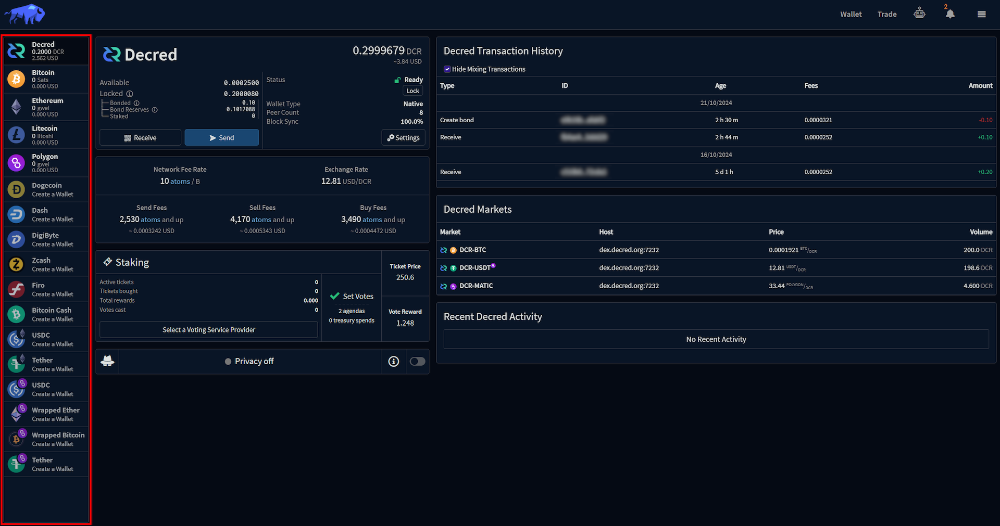

## Creating a New Wallet

If you wish to create additional wallets beyond those set up during the 
[Quick Configuration](Quick-Configuration), click the desired
asset and click on the `Create Wallet` button. 

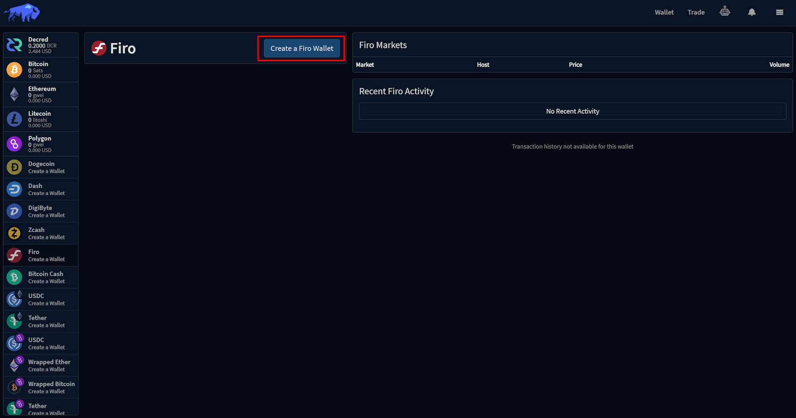

Most users will utilize the native wallets already built into Bison Wallet. Based on the asset, 
you may have the option to choose between a Native/SPV Wallet, an external full node wallet, 
or an Electrum-based wallet.

If a native wallet has already been created for a selected asset, you can modify the wallet type 
through the Wallet Settings dialog.

### Native Wallet

All private keys and accounts for Bison Wallet's native wallets are derived from the application's seed, 
ensuring that reinitializing the wallet from this seed will restore all wallets and associated token wallets. 
The keys are exclusively managed by the application, and all transaction signing is securely 
processed through Bison Wallet.

Bison Wallet's native Bitcoin and Litecoin wallets use [Neutrino](https://github.com/lightninglabs/neutrino), 
while the native Decred wallet utilizes 
[Decred's Simple Payment Verification (SPV)](https://docs.decred.org/wallets/spv/) implementation. These native 
wallets provide fast, lightweight functionality with minimal resource usage, while preserving
privacy by limiting data exposure during transaction verification. 

For Ethereum Virtual Machine (EVM) compatible assets, such as Ethereum and Polygon, Bison Wallet leverages RPC 
Providers. which serve as the wallet's gateway to the respective blockchain networks, read more about 
[RPC Providers](#rpc-providers-for-evm-compatible-networks) in their respective section of this wiki.

Creating a new native wallet is simple—no additional parameters are needed. Just click the **Create** button in the
`Add a Wallet` dialog.


### External Wallet

Bison Wallet supports using full node and Electrum-based wallets, depending on the asset. 

If using external wallet software, you **must** ensure it remains running while Bison Wallet is running. Do not shut 
down, lock, unlock, or otherwise modify your wallet settings while Bison Wallet is running. Also, only send funds 
from within Bison Wallet, not directly from the external wallet's own controls. Finally, do not manually lock 
or unlock any coins while Bison Wallet is running.

#### Full Node

A full node wallet operates by downloading and storing the entire blockchain for a given asset. It independently 
verifies every transaction and block, offering maximum security, privacy, and decentralization. While it provides 
a high level of trust, it requires more storage, bandwidth, and processing power compared to lightweight or 
SPV wallets.

Bitcoin Core and most wallets based on it support block pruning, which can reduce blockchain storage to just a few 
gigabytes instead of the full blockchain size. However, a larger storage allocation is recommended to avoid full 
reindexing if the wallet is used infrequently. Additionally, for accurate network fee estimates, the full node 
should remain running for several blocks before placing any orders.


> [!NOTE]
> The following section provides a step-by-step guide for configuring a Litecoin Core  wallet as an example. 
Please note that some steps may vary if you are using a different network.

Some manual configuration of the full node's RPC server is also required. This can be done via command line parameters
or by editing the configuration file (e.g., `bitcoin.conf`, `litecoin.conf`, etc.), adding the following lines,
replacing the values as needed:
```ini
server=1
rpcuser=<Username>
rpcpassword=<Password>
rpcbind=<Address>:<Port Number>
```
When configuring your wallet in Bison Wallet:
* **Wallet Name:** the name of the wallet as created in the external wallet.
* **JSON-RPC Username:** value entered for rpcuser.
* **JSON-RPC Password:** value entered for rpcpassword.
* **JSON-RPC Address:** value entered for rpcbind.
* **Wallet Password:** the passphrase for unlocking the external wallet, leave blank if it's not encrypted.

The wallet status will be indicated in the [Wallet Details](#wallet-details) section once the wallet has been
correctly configured.


### Electrum

[Electrum](https://electrum.org/) is a type of light wallet that allows users to interact with the respective blockchain 
without running a full node, it works by connecting to external servers instead. Light wallets provide a level of 
convenience but there are often subtle consequences due to their reliance on centralized services, read more about this 
topic in the
[Decred Documentation](https://docs.decred.org/wallets/spv/#how-is-this-different-from-a-light-wallet). 

The Electrum option in Bison Wallet is less mature and provides less privacy than the full node or native wallets. 


> [!NOTE]
> The following section provides a step-by-step guide for configuring a Litecoin Electrum wallet as an example. 
Please note that some steps may vary if you are using a different network.

Some manual configuration of the Electrum wallet's RPC server is also necessary, this can be done via 
[CLI](https://electrum.readthedocs.io/en/latest/jsonrpc.html) or, using the console in the GUI. 
From the menu bar in the Electrum wallet, click ``View > Show Console`` and enter the following commands, 
replacing the values as required:

```py
setconfig('rpcuser','<Username>')
setconfig('rpcpassword','<Password>')
setconfig('rpcport','<Port Number>') 
setconfig('rpchost','<Address>')
```
Once the values have been set, shutdown and restart Electrum. In the Bison Wallet dialog, enter the following
values:

* **JSON-RPC Username:** value entered for rpcuser.
* **JSON-RPC Password:** value entered for rpcpassword.
* **JSON-RPC Port:** value entered for rpcport
* **Wallet Password:** the passphrase for unlocking the external wallet, leave blank if it's not encrypted.

> [!NOTE]
> By default, Bison Wallet is set up for ``default_wallet`` as the wallet name and ``localhost`` as the rpchost for 
> Electrum - this can be modified in the ``Wallet File`` and ``JSON-RPC Host`` fields under ``show additional settings``.

The wallet status will be indicated in the [Wallet Details](#wallet-details) section once the wallet has been
correctly configured.


# Wallet Details

The wallet details section gives a summary of the funds (available and locked) for the selected 
asset and the wallet synchronization status, it also provides access to the Wallet settings, 
Send and Receive functionality.

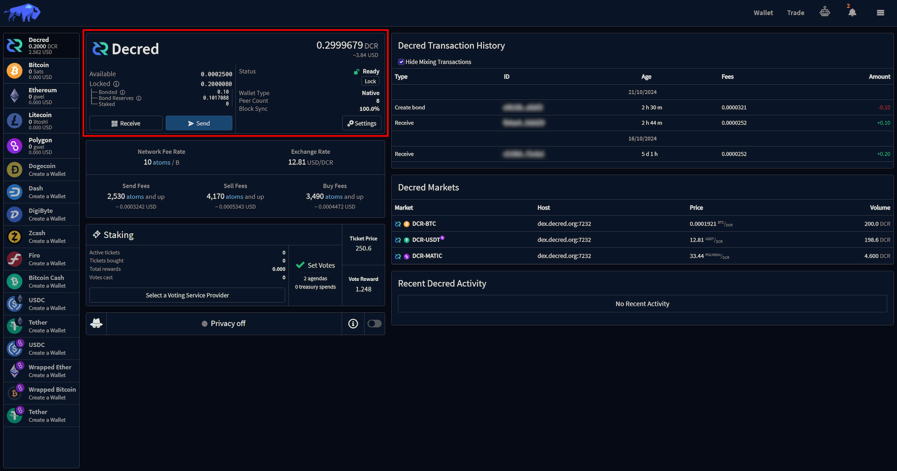

* **Available:** are unlocked funds that can be immediately used.
* **Locked:** Total funds temporarily locked to cover the costs of your bond maintenance, 
live orders, matches and other activities.
    * **Bonded:** Funds locked in active bonds.
    * **Bond Reserves:** Funds reserved to cover the expenses associated with bond maintenance.
* **Status:** Indicates the wallet status.
* **Wallet Type:** Indicates if the configured wallet is [Native](#native-wallet) or [External](#external-wallet).
* **Peer Count:** The number of connected outbound peers for the network, this is
intentionally limited to a maximum of 8 peers.
* **Block Synch:** The blockchain synchronization progress status.

## Receive

This is where you can generate wallet addresses to give to other people and receive funds into Bison Wallet.
Addresses for UTXO-based assets like Bitcoin, Decred and Litecoin can be used as many times as you want, 
but for privacy reasons its best to generate a new one for each transaction. 

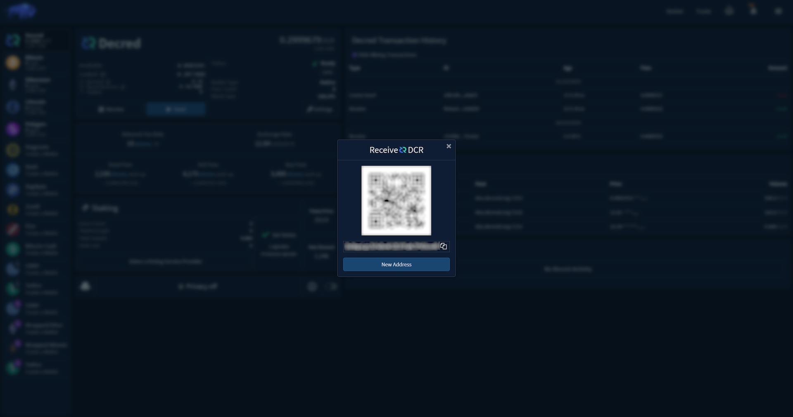

## Send

This is where you can send funds from your wallet to another address. You will need to enter the recipient 
address into the text box and the amount of funds you wish to send.

* **Subtract Fees from amount sent:** if left unchecked, the fees will be deducted from the remaining
balance in the wallet.
* **Max Estimated Send:** the estimated amount that will be received if you withdraw your current balance 
with 'Subtract fees  from amount sent' checked. 
* **Max Estiamted Send Fee:** the estimated on-chain fee for the specified transaction.

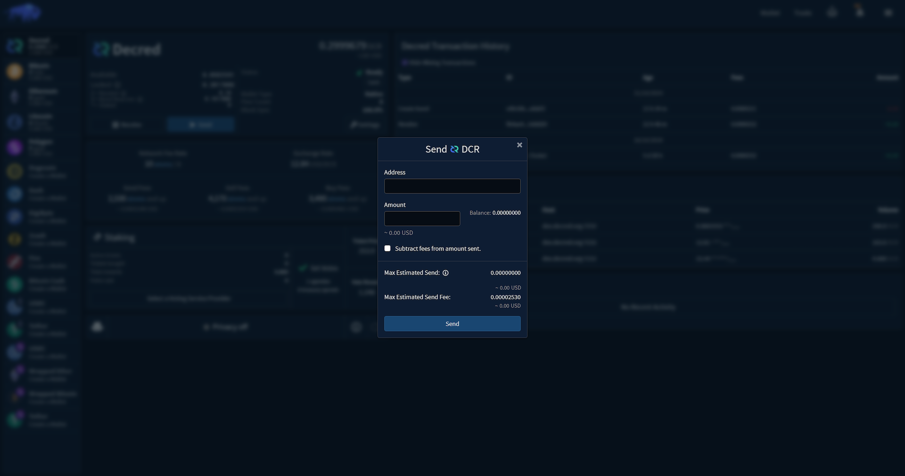

After reviewing these numbers, you can press the `Send` button and a new prompt will appear, confirming
estimated fees and total spend. Once you enter your password and click `Confirm`, your transaction 
will be broadcast.


## Wallet Settings

The parameters and functions available under Wallet Settings vary depending on the asset and the type of wallet 
selected. The wallet settings panel also allows you to change the wallet type (e.g. Native/SPV, Electrum or Full Node).
Descriptions for each parameter are also available within the settings panel in Bison Wallet by hovering 
over the information icon.

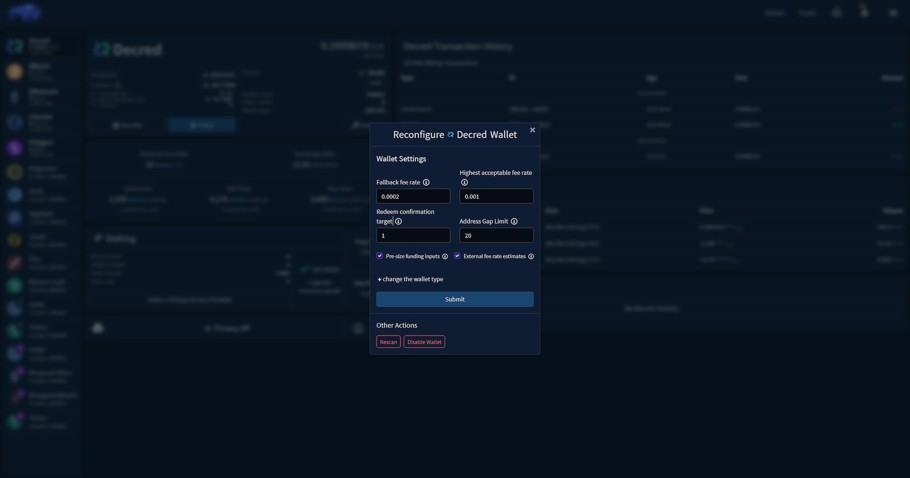


## Common Parameters

* **Fallback Fee Rate:** The fee rate to use for fee payment and withdrawals when estimatesmartfee 
is not available.
* **Highest acceptable fee rate:** This is the highest network fee rate you are willing to pay on swap transactions. 
If feeratelimit is lower than a market's maxfeerate, you will not be able to trade on that market with this 
wallet.
* **Redeem confirmation target:** The target number of blocks for the redeem transaction to be confirmed. 
Used to set the transaction's fee rate.
* **Address Gap Limit:** The gap limit for used address discovery.
* **Pre-size funding inputs:** When placing an order, create a split transaction to
fund the order without locking more of the wallet balance than necessary.
If this option is left unchecked, excess funds may be reserved to fund the order
until the first swap contract is broadcast during match settlement, or the order is cancelled.
Pre-sizing funding inputs creates an extra transaction for which network mining fees are paid.
* **External Fee Rate Estimates:** Allow fee rate estimation from a block explorer API. 
This is useful as a fallback for SPV wallets and RPC wallets that have recently been started.
* **RPC Provider:** Specify one or more RPC providers. For infrastructure providers, prefer using wss address. 
Only url-based authentication is supported. For a local node, use the filepath to an IPC file. Further information
on [RPC Providers](#rpc-providers-for-evm-compatible-networks) can be found in their 
respective section of the wiki. 
* **Gas Fee Limit:** This is the highest network fee rate you are willing to pay on swap transactions. 
If gasfeelimit is lower than a market's maxfeerate, you will not be able to trade on that market with this wallet. This setting is only applicable to account based assets.


## External Wallet Parameters

* **Account Name:** Primary dcrwallet account name for trading. If automatic mixing of trading funds is desired, 
this should be the wallet's mixed account and the other accounts should be set too. 
* **Change Account Name:** dcrwallet change account name. This and the 'Temporary Trading Account' should only be 
set if mixing is enabled on the wallet. If set, deposit addresses will be from this account and will 
be mixed before being available to trade.
* **Temproary Trading Account:** dcrwallet account to temporarily store split tx outputs or change from chained swaps in
multi-lot orders. This should only be set if 'Change Account Name' is set.
* **RPC Username:** dcrwallet's 'username' setting for JSON-RPC.
* **RPC Password:** dcrwallet's 'password' setting for JSON-RPC.
* **RPC Address:** dcrwallet's address (host or host:port) (default port: 9110).
* **TLS Certificate:** Path to the dcrwallet TLS certificate file.
* **Wallet Name:** the name of the external wallet.
* **JSON-RPC Username:** electrum or full node 'rpcuser' setting.
* **JSON-RPC Password:** electrum or full node 'rpcpassword' setting.
* **JSON-RPC Address:** electrum or full node address, <addr> or <addr>:<port> (default 'localhost').
* **JSON-RPC Port:** electrum or full node port for RPC connections (if not set in rpcbind).
* **Wallet File:** full path to the wallet file (empty is default_wallet).

## Wallet Settings Functions

* **Change Wallet Type:** Allows changing the wallet to Native (SPV), electrumRPC or full node, depending on the asset.
* **Rescan:** Begins a rescan for all relevant transactions involving all active addresses and watched outpoints.
Rescans can be time-consuming depending on the amount of data that must be checked, and the size of the blockchain.
* **Recover:** Moves all wallet data to a backup folder and re-initializes the wallet.
You will have to wait until the wallet syncs with the network, which could potentially take a long time, 
before you can use the wallet again. 
* **Export Wallet:** Export the wallet's private key for recovery on another Ethereum wallet. Using an externally 
restored wallet while you have active trades running in Bison Wallet could result in failed trades and lost funds.
It is recommended that you **do not** export your wallet unless you are an experienced user and you know what are doing.
* **Disable Wallet:** This function will disable the wallet, it will not be connected to when you start Bison Wallet
and cannot be used until it is re-enabled. This will also disable all token wallets that depend on this wallet.
* **Manage Peers:** Allows adding/removing of network peers.
* **Wallet Logs:** Opens the log file for the wallet.


# Fee Status

The fee status section contains summary information around the fees associated with the selected asset.

* **Network Fee Rate:** fee rate is the number of units per byte or gas unit that a user pays to add their transaction to the specified blockchain.
* **Exchange Rate:** USD exchange rate for the selected asset.
* **Send Fees:** Minimum fee for transferring funds on the blockchain.
* **Sell Fees:** Minimum fee for performing a sell trade on the blockchain.
* **Buy Fees:** Minimum fee for performing a buy trade on the blockchain.

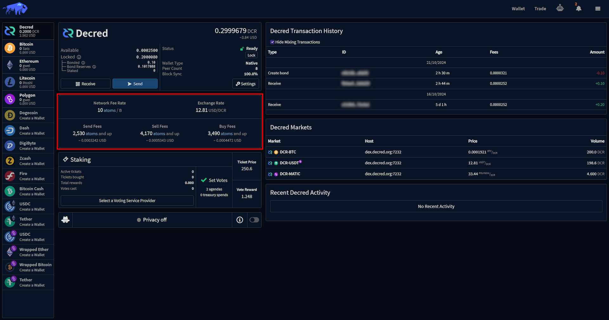

# Transaction History

This section shows a list of all transactions that have occurred involving this wallet, including send, receive
bonds, splits and mixes.

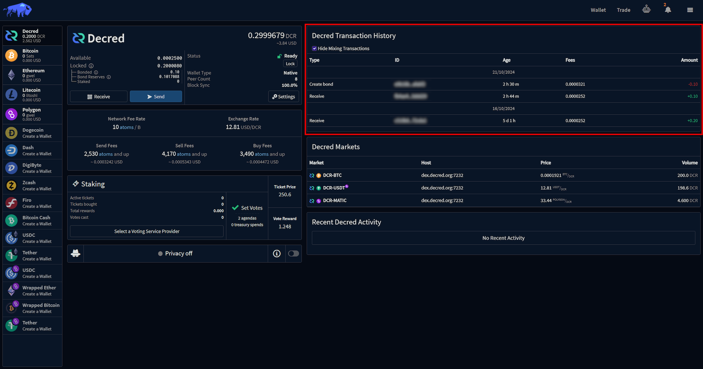

Clicking on a transaction will open the Transaction Details dialog, which displays
summary information about the transaction along with a link to a block explorer.

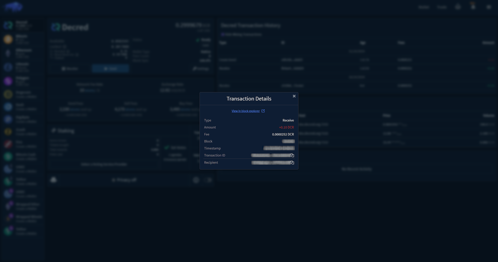

# Asset Markets

The asset markets section displays the available markets for the selected assets within the connected DEX servers.

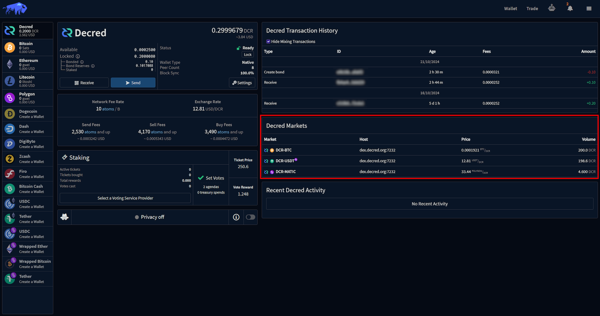

# Recent Activity

The recent activity section lists the recent order history for the specified asset. 

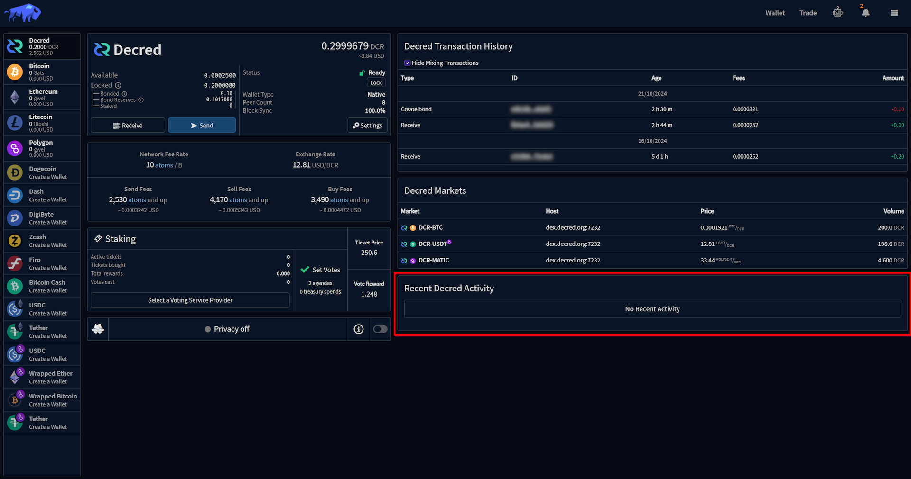

Summary information for each order is displayed in the recent activity section. 
The [Order Details](Order-Management#order-details) view can be opened by clicking
the  button. 


# Asset-Specific Features

This section of the wallet view contains functionality specific to the selected asset.

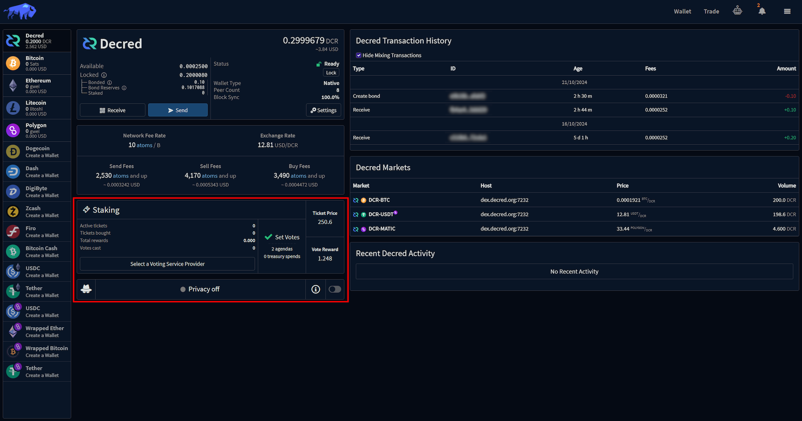


## Decred 


## Privacy

When privacy is enabled, all of your funds are sent through Decred's address history obfuscation service, using a 
protocol called StakeShuffle. StakeShuffle generates outputs that cannot be definitively linked to previous on-chain 
activity. While output amounts remain visible, the destruction of traceability means your on-chain history can no longer 
be inferred from publicly available data.

Decred's StakeShuffle is particularly powerful because Decred wallets integrate privacy with staking, facilitating a 
consistently large anonymity set—an essential feature for privacy. Privacy is completely optional and can be disabled at
any time. While there are increased transaction fees associated with using Decred's privacy features, these fees have 
historically been relatively negligible.

The StakeShuffle mixing process is fully decentralized, with coordination handled peer-to-peer by full nodes in the 
network. Mix coordination occurs every 10 minutes, and the wallet must remain unlocked during the mixing process.

## Staking

Decred Staking allows users to participate in the network's governance and earn rewards by locking up their DCR 
in exchange for tickets. These tickets grant voting rights on proposals, changes to the network, treasury expenditures, and block validation in the Proof-of-Stake (PoS) system. Once a ticket is randomly selected to vote, the user earns a 
staking reward. This system promotes decentralization, as stakeholders have a direct say in the network's future, 
while also securing the blockchain and earning passive income for participants. 

Before purchasing a ticket in Bison Wallet, you'll have to select a Voting Service Provider (VSP). VSPs are 
third-party services that help users participate in staking without needing to keep a full node online 24/7. 
VSPs manage the ticket voting process on behalf of users in exchange for a small fee, ensuring their tickets can vote 
when selected. This makes staking more accessible for users who cannot maintain a full node but still want 
to earn staking rewards and participate in network governance. VSPs are completely noncustodial - they never have
access to any of their user’s funds - the user is only delegating the rights to vote their tickets to the VSP.


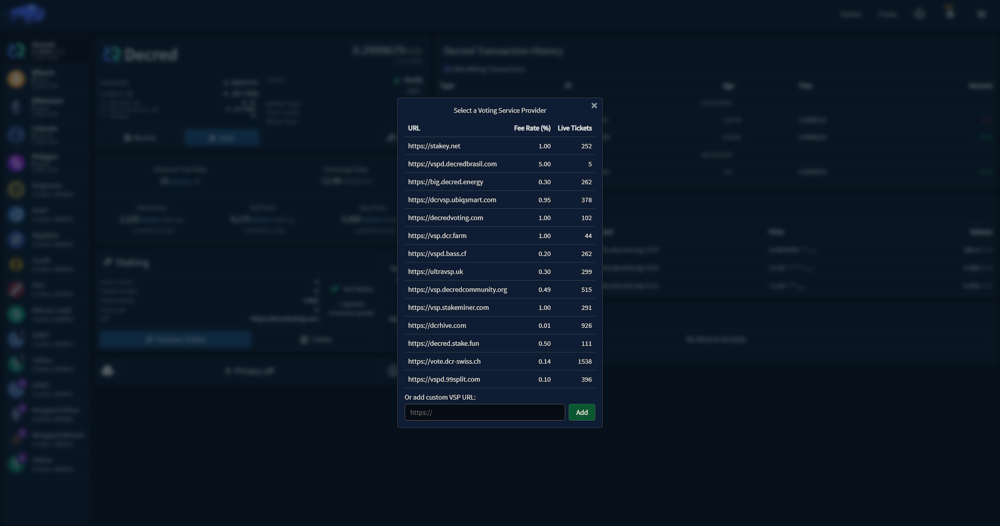

Once the VSP has been selected, the `Purchase Tickets` button will display a prompt where you can specify the amount
of tickets you wish to purchase. The price of a ticket is determined by an algorithm that aims to keep the ticket pool 
size, which is the total amount of tickets in the PoS system ticket pool, around a target size of 40,960 tickets.

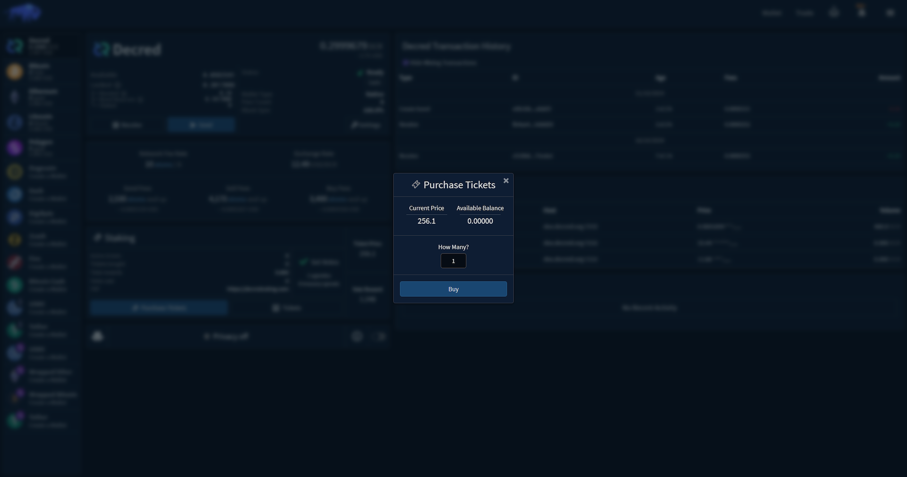

When a ticket is purchased, your funds are temporarily unavailable for spending while the ticket participates in 
the staking process. Once the ticket votes or expires, the staked coins, along with any earned rewards, 
are returned to your wallet. The average time it takes for a ticket to vote is 28 days, but it can possibly require up 
to 142 days, with a 0.5% chance of expiring before being chosen to vote (this expiration returns the original 
Ticket Price without a reward).

Read more about Decred's Proof-of-Stake system in the 
[Decred Documentation](https://docs.decred.org/proof-of-stake/overview/).

## Voting Preferences

Bison Wallet enables Decred stakeholders to participate in on-chain governance by setting their voting preference for 
consensus rules and treasury spends votes. Clicking the Agendas button on the Decred wallet will display the active
agendas and let you set your vote preference.

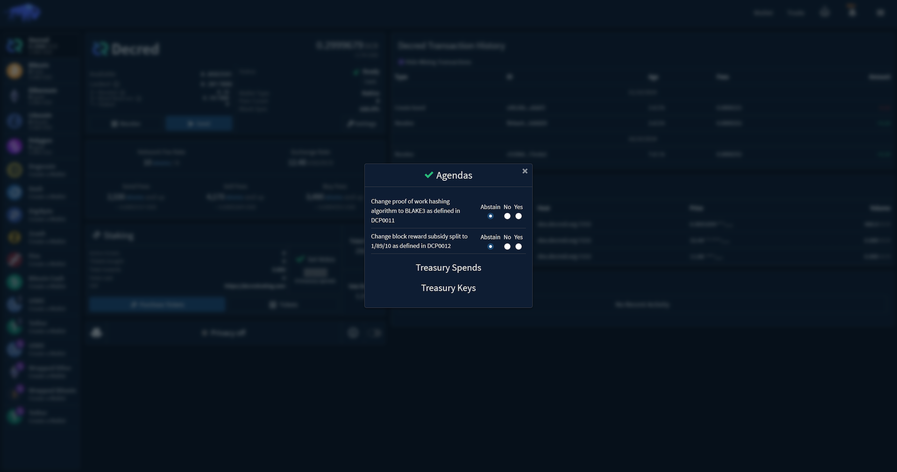

Read more about Decred's Governance in the [Decred Documentation](https://docs.decred.org/governance/overview/).


# RPC Providers for EVM-Compatible Networks

_This section of the wiki is only applicable to Ethereum and Polygon._

The native Ethereum and Polygon wallets in Bison Wallet leverage RPC Providers, which serve as the wallet's 
gateway to the respective blockchain networks for EVM (Ethereum Virtual Machine) compatible assets. For example, 
many casual Ethereum users are familiar with Infura, which is the default RPC provider for popular wallets 
such as MetaMask. 

When setting up your wallets for EVM-compatible assets in Bison Wallet, it will use a default set of public 
RPC providers, which could become outdated or unreliable. We recommend that you specify the full path to a custom 
RPC provider, i.e., an RPC endpoint. Refer to the RPC Provider List below for suggestions.

The types of endpoints that are supported are:

- (**Recommended**) WebSocket (ws:// or wss:///). These use a persistent
  connection, which is efficient and supports new block subscriptions to reduce
  provider utilization and bandwidth.
- HTTP (http:// or https://). These are less efficient and do not support new
  block subscriptions, so the client frequently polls for new blocks.
- IPC. These are typically a special file on your local machine. You must be
  running a local node to use this, and the IPC file permissions must be set to
  allow Bison Wallet app to use it. However, typically even a full node will expose a
  WebSocket interface.

## RPC Provider Considerations

Consider the following tips when configuring your EVM-compatible wallets:

- Use **multiple providers**, even if one of them is your own full node. This
  provides redundancy. Often a provider will fall behind or even stall, so
  use of multiple providers adds robustness to your wallet.

- Get a personal RPC endpoint, with your own **private API key**. Many providers
  will allow you to create a personal endpoint that includes an API "key" that
  is assigned just to you.
  
  This is important since all providers have request rate limits, which may be
  exhausted quickly with a generic RPC endpoint (e.g.
  <https://rpc.ankr.com/eth>) that enforce rate limiting based on the source IP
  address. This is particularly important if you use a VPN or other proxy where
  you share an outbound IP address with many other people.

  Further, taking the time to get an endpoint with your personal API key often
  gives you access to a "dashboard" with the provider so you can monitor your
  API requests.

- Use **WebSockets** (wss:// URL scheme) when using a third-party RPC provider.
  It is much more efficient than HTTP, the wallet will become aware of new
  blocks sooner, and it will consume less of your quota with the provider. The
  application may attempt a WebSocket connection even when given an HTTP
  endpoint, but it is best to specify it explicitly if it is known.

- Use a private full node for one of your endpoints, if you are able to.

- Even if you use a private full node, use backup RPC providers! Running an
  Ethereum node is difficult. You will experience downtime when you least expect
  it.

## Custom RPC Provider List (partial)

Some common Ethereum RPC providers are listed at <https://ethereumnodes.com/>.

A handful that we have tested:

- [NodeReal](https://dashboard.nodereal.io/) - personal API key, wss
- [Alchemy](https://www.alchemy.com/overviews/private-rpc-endpoint) - personal API key
- [LlamaNodes](https://llamanodes.com/) - personal API key, wss, web3 sign-in, no testnet
- [Rivet](https://rivet.cloud/) - personal API key, wss, web3 sign-in
- [Blast](https://blastapi.io/login?app=consumer) - personal API key, wss, web3 sign-in
- [OmniaTech](https://app.omniatech.io/dashboard/generate-endpoints) - personal API key, wss, web3 sign-in
- [Ankr](https://www.ankr.com/rpc/) - generic endpoint, often behind a few blocks, possibly http-only
- [Publicnode](https://ethereum.publicnode.com/) - generic endpoint, possibly http-only
- [Infura](https://docs.infura.io/infura/reference/network-endpoints) is also
extremely reliable and common, but their data sharing and retention policy has
been under fire recently. Decide for yourself.
- The Flashbots Protect RPC service is **not recommended** for the DEX wallet
since the public mempool is only used in certain circumstances, which is not
helpful for the DEX wallet. Further, Flashbots will abandon transactions that
are not mined within 6 minutes, and while it is expected that transactions will
be mined more promptly, this is not desirable.

Some providers allow you to sign in with a web3 wallet (e.g. MetaMask) to create
a personal API key and access a dashboard. This may be preferable to creating an
account with an email address.

---

Next Section: [Trade](Trade)

[⤴  Back to Top](#top)